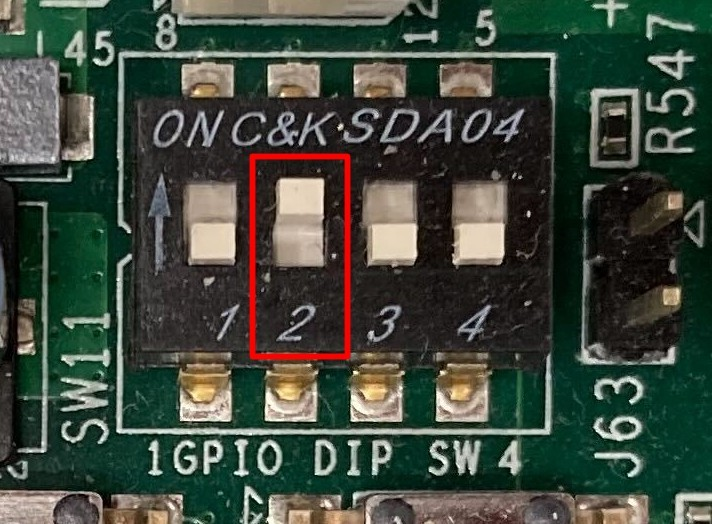
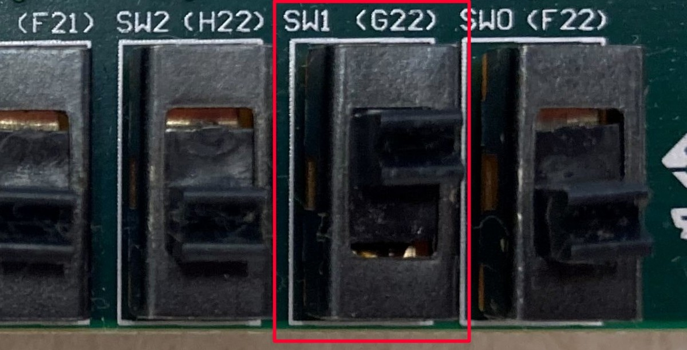
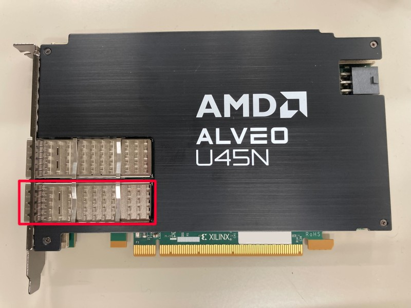

# AIST-TSN Switch

This repository is part of the [AIST TSN](https://github.com/CCIRT/aist-tsn) project. It introduces the hardware design of an L2 network switch supporting Time Sensitive Networks (TSN).
We aim to provide an open platform that can be used as a reference design so scientists can implement their desired functionalities and make the different evaluations and comparisons to highlight the appropriate design choices for a given TSN system.

## Designs

This repository includes two flavors of an L2 TSN switch supporting two different scheduling algorithms. Both designs are implemented and validated on an AMD Xilinx KC705 FPGA evaluation board and an Avnet ZedBoard which were attached to an [Opsero OP031-2V5 Ethernet FMC](https://ethernetfmc.com/docs/ethernet-fmc/compatibility/#series-7-boards) via FMC connector:

- 1GbE L2 switch supporting CBS:
  - [Specification](./docs/cbs-switch/specification.md)
  - [FPGA design docs](./docs/cbs-switch/design_top.md)



- 1GbE L2 switch supporting ATS:
  - [Specification](./docs/ats-switch/specification.md)
  - [FPGA design docs](./docs/ats-switch/design_top.md)


- 10GbE L2 switch supporting CBS:
  - [Specification](./docs/cbs-switch/specification.md)
  - [FPGA design docs](./docs/cbs-switch/design_top_10g.md)



- 10GbE L2 switch supporting ATS:
  - [Specification](./docs/ats-switch/specification.md)
  - [FPGA design docs](./docs/ats-switch/design_top_10g.md)



## Licensing

Copyright (c) 2024-2026 National Institute of Advanced Industrial Science and Technology (AIST)
All rights reserved.

This software is released under the [MIT License](LICENSE).

When using the provided designs in this repository, please refer to the following citations:

CBS:
> Akram BEN AHMED, Takahiro HIROFUCHI, and Takaaki FUKAI "FPGA-based Network Switch Architecture Supporting Credit Based Shaper for Time Sensitive Networks", The 29th IEEE International Conference on Emerging Technologies and Factory Automation (ETFA2024), Sep 2024
>
> [Paper](docs/papers/ETFA2024_paper.pdf); [Slides](docs/papers/ETFA2024_slides.pdf)


ATS:
> Akram BEN AHMED, Takahiro HIROFUCHI, and Takaaki FUKAI, "Hardware design and Evaluation of an FPGA-based Network Switch Supporting Asynchronous Traffic Shaping for Time Sensitive Networking", [IEEE Access](https://ieeexplore.ieee.org/document/10658978), vol. 12, pp. 123149-123165, Aug 2024 
>
> [Revised paper](docs/papers/IEEEAccess_June2024_Published_corrected.pdf) ([errata](docs/papers/errata.md) corrected)


We would be happy to hear from you when you use the deliverables from this repository in your project.
It will be our encouragement.

## Requirements

The design was implemented and validated using the following environment

### Hardware (1G)

- AMD Kintex 7 FPGA KC705 Evaluation Kit or Avnet ZedBoard
- Opsero OP031-2V5 Ethernet FMC
  - Connect to the "FMC HPC" connector (KC705)
  - Connect to the "FMC LPC" connector (ZedBoard)

### Hardware (10G)

- AMD Alveo U45N
- Cable corresponding to the destination slot
  - SFP+ (10GbE NIC, etc.)
    - Breakout cable: QSFP28 to SFP28 or QSFP+ to SFP+
  - QSFP28 or QSFP+ (FPGA or 100GbE NIC, etc.)
    - QSFP28 cable or QSFP+ cable

### Software

- Ubuntu 20.04.3 LTS
- Vivado v2022.1
  - Set the `PATH` environment variable for Vivado properly
  - If you do not plan to generate a bitstream file (i.e., the binary file to program the FPGA) yourself, Lab Edition will be sufficient.
- CMake 3.14 or later

## How to build the device

You can download a pre-built bitstream file from [the Releases section](https://github.com/CCIRT/aist-tsn-switch/releases). If you want to generate the bitstream on your own, please follow the steps below.

A license for AMD Tri-mode Ethernet MAC (TEMAC) IP is required to synthesize the Vivado project. You can obtain the evaluation license free of charge.

- Set the `XILINXD_LICENSE_FILE` environment variable properly to refer to the license file.

Change the PATH search order to avoid using the old cmake included in the Vivado directory.

```sh
(after vivado setting. e.g. "source <VIVADO_ROOT>/settings64.sh")
export PATH=/usr/local/bin:/usr/bin:$PATH
```

All designs will be built by running the command below.

```sh
cd <Repository top>
# KC705 design
./build_device.sh impl_all
# ZedBoard design
./build_device.sh impl_all-zedboard
# U45N design
./build_device.sh impl_all-10g
```

Bitstreams will be generated below.

- L2 switch with ATS
  - `./build-device/vivado/ats-switch/ats-switch.prj/ats-switch.runs/impl_1/design_1_wrapper.bit` (KC705)
  - `./build-device/vivado/ats-switch/ats-switch-zedboard.prj/ats-switch-zedboard.runs/impl_1/design_1_wrapper.bit` (ZedBoard)
  - `./build-device/vivado/ats-switch/ats-switch-10g.prj/ats-switch-10g.runs/impl_1/design_1_wrapper.bit` (U45N)
- L2 switch with CBS
  - `build-device/vivado/cbs-switch/cbs-switch.prj/cbs-switch.runs/impl_1/design_1_wrapper.bit` (KC705)
  - `build-device/vivado/cbs-switch/cbs-switch-zedboard.prj/cbs-switch-zedboard.runs/impl_1/design_1_wrapper.bit` (ZedBoard)
  - `build-device/vivado/cbs-switch/cbs-switch-10g.prj/cbs-switch-10g.runs/impl_1/design_1_wrapper.bit` (U45N)

## Notes for each FPGA board
- KC705
  - Switch settings
    - Set DIP switch 2, labeled SW11, to the upper position as shown in the photo.
    - The status of the other switches does not matter.

      

- ZedBoard
  - Switch settings
    - To match VADJ to OP031-2V5, please short the jumper on J18 to the 2V5 position.
    - Set the SW1 toggle switch to the upper position as shown in the photo.
    - The status of the other switches does not matter.

      

- U45N
  - Connecting breakout cable
    - The FPGA has two QSFP28 slots.
    - Use the QSFP28 slot near the PCIe edge:.

      

    - Connect the QSFP+ end of the breakout cable to the FPGA and the SFP+ end to a device such as a 10G NIC.

## Directories

- [3rdparty](3rdparty): 3rd-party projects
- [cmake](cmake): Common CMake files
- [device](device): Source code. See [device/README.md](device/README.md).
- [docs](docs): Documentation (e.g., design overviews and register maps)
- [evaluation](evaluation): Evaluation data for the papers. See [evaluation/README.md](evaluation/README.md) for more info.
- [evaluation2](evaluation2): Evaluation data with [EFCC](https://github.com/CCIRT/aist-tsn-efcc). See [evaluation2/README.md](evaluation2/README.md) for more info.
- [util](util): Scripts for FPGA register modification and python modules to use our switches.

## Version notes

- Upcoming
  - Avoid accidental use of Vivado-bundled CMake
  - Added FPGA design of 10GbE, L2 switch with CBS for U45N
  - Added FPGA design of 10GbE, L2 switch with ATS for U45N
  - Enable board identification by device-specific ID
  - Enable FDB learning from broadcast frames (Fix communication issue in multi-hop switch setup)
- v2.0 (Oct 2025)
  - Added FPGA design of 1GbE, L2 switch with CBS for ZedBoard
  - Added FPGA design of 1GbE, L2 switch with ATS for ZedBoard
  - Added python modules to make our switches easier to use.
    - Added python scripts to perform register settings that are more useful than TCL scripts.
    - Obsoleted TCL scripts
  - Added evaluation scripts and results with our hardware-based measurement tool called EFCC. The evaluation is done in more complicated input patterns, and is easier to reproduce.
  - Optimized RTL implementation to reduce resources and latency.
- v1.0 (Sep 2024)
  - Initial release
  - FPGA design of 1GbE, L2 switch with CBS for KC705
  - FPGA design of 1GbE, L2 switch with ATS for KC705
  - Evaluation scripts and results for the papers
  - TCL script to perform register settings

## Contact

The Continuum Computing Architecture Research Group (CCARG), Intelligent Platforms Research Institute (IPRI), the National Institute of Advanced Industrial Science and Technology (AIST), Japan.

Research Group Leader: Takahiro Hirofuchi, Ph.D.

We are hiring postdocs and technical staffs. Collaborations are also welcome.

## Acknowledgment

This program is based on results obtained from the project, "Research and
Development Project of the Enhanced infrastructures for Post 5G Information and
Communication Systems" (JPNP20017), commissioned by the New Energy and
Industrial Technology Development Organization (NEDO).
