# AIST-TSN

AIST-TSN is an open source project developed by the National Institute of Advanced Industrial Science and Technology (AIST), Japan.
It introduces the hardware design of an L2 network switch supporting Time Sensitive Networks (TSN).
We aim to provide an open platform that can be used as a reference design so scientists can implement their desired functionalities and make the different evaluations and comparisons to highlight the appropriate design choices for a given TSN system.

## Designs

This repository includes two flavors of an L2 TSN switch supporting two different scheduling algorithms. Both designs are implemented and validated on an AMD Xilinx KC705 FPGA evaluation board which was attached to an [Opsero OP031-2V5 Ethernet FMC](https://ethernetfmc.com/docs/ethernet-fmc/compatibility/#series-7-boards) via the "FMC HPC" connector:

- L2 switch supporting CBS:
  - [Specification](./docs/cbs-switch/specification.md)
  - [FPGA design docs](./docs/cbs-switch/design_top.md)



- L2 switch supporting ATS:
  - [Specification](./docs/ats-switch/specification.md)
  - [FPGA design docs](./docs/ats-switch/design_top.md)


## Licensing

Copyright (c) 2024 National Institute of Advanced Industrial Science and Technology (AIST)
All rights reserved.

This software is released under the [MIT License](LICENSE).

When using the provided designs in this repository, please refer to the following citations:

CBS:
> Akram BEN AHMED, Takahiro HIROFUCHI, and Takaaki FUKAI "FPGA-based Network Switch Architecture Supporting Credit Based Shaper for Time Sensitive Networks", The 29th IEEE International Conference on Emerging Technologies and Factory Automation (ETFA2024), Sep 2024

ATS:
> Akram BEN AHMED, Takahiro HIROFUCHI, and Takaaki FUKAI, "Hardware design and Evaluation of an FPGA-based Network Switch Supporting Asynchronous Traffic Shaping for Time Sensitive Networking", [IEEE Access](https://ieeexplore.ieee.org/document/10658978), vol. 12, pp. 123149-123165, Aug 2024 

### Erratum Notice
Unfortunately, we have discovered the presence of a couple of typos in the above published [IEEE Access](https://ieeexplore.ieee.org/document/10658978) article.
We urge readers to pay attention to these typos as they may compromise the correct understanding of our proposed approach:

- Page 6, Algoithm 1:
  > SchedulerEligibilityTime = BucketEmptyTime **/** LengthRecoveryDuration; <br>

Must be corrected to:<br>

    > SchedulerEligibilityTime = BucketEmptyTime **+** LengthRecoveryDuration; 
  
- Page 7, End of Section IV-C-2:
> - In our prototype, ... the Input Ethernet frame embedded in the **Ethernet** Header, <br>

Must be corrected to:<br>

> - In our prototype, ... the Input Ethernet frame embedded in the **IP** Header 

- Page 8, End of Section IV-E:
> - If EligibilityTime **<** (t), ... <br>
> - EligibilityTime **≥** (t),

Must be corrected to:
> - If EligibilityTime **≤** (t), ...
> - EligibilityTime **>** (t),

We would be happy to hear from you when you use the deliverables from this repository in your project.
It will be our encouragement.

## Requirements

The design was implemented and validated using the following environment

### Hardware

- AMD Kintex 7 FPGA KC705 Evaluation Kit
- Opsero OP031 Ethernet FMC
  - Connect to the "FMC HPC" connector on KC705

### Software

- Ubuntu 20.04.3 LTS
- Vivado v2022.1
  - Set the `PATH` environment variable for Vivado properly
- CMake 3.14 or later

## How to build the device

A license for AMD Tri-mode Ethernet MAC (TEMAC) IP is required to synthesize the Vivado project. You can obtain the evaluation license free of charge.

- Set the `XILINXD_LICENSE_FILE` environment variable properly to refer to the license file.

All designs will be built by running the command below.

```sh
cd <Repository top>
./build_device.sh impl_all
```

Bitstreams will be generated below.

- L2 switch with ATS
  - `./build-device/vivado/ats-switch/ats-switch.prj/ats-switch.runs/impl_1/design_1_wrapper.bit`
- L2 switch with CBS
  - `build-device/vivado/cbs-switch/cbs-switch.prj/cbs-switch.runs/impl_1/design_1_wrapper.bit`

## Directories

- [3rdparty](3rdparty): 3rd-party projects
- [cmake](cmake): Common CMake files
- [device](device): Source code. See [device/README.md](device/README.md).
- [docs](docs): Documentation (e.g., design overviews and register maps)
- [evaluation](evaluation): Evaluation data for the papers. See [evaluation/README.md](evaluation/README.md) for more info.
- [util](util): Scripts for FPGA register modification

## Contact

The Continuum Computing Infrastructure Research Team (CCIRT), the Digital Architecture Research Center (DigiARC), the National Institute of Advanced Industrial Science and Technology (AIST), Japan.

E-mail: <M-digiarc-ccirt-contact-ml@aist.go.jp>

We are hiring postdocs and technical staffs. Collaborations are also welcome.

## Acknowledgment

This program is based on results obtained from the project, "Research and
Development Project of the Enhanced infrastructures for Post 5G Information and
Communication Systems" (JPNP20017), commissioned by the New Energy and
Industrial Technology Development Organization (NEDO).
