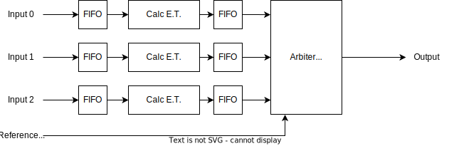

# ATS block

- This block has 3 inputs, which are from different input ports
- First, input frame is switched to one of the eight Traffic Classes based on the Priority Code Point (PCP)
  - The higher the Traffic Class number, the higher the priority
  - Traffic Class 7 is processed by the ATS scheduler as Priority 1
  - Traffic Class 6 is processed by the ATS scheduler as Priority 0
  - Traffic Class 5 and below are processed by the FIFO scheduler
- After switching, frame is stored in Queue
  - Queues are independent by each inputs and priorities
- ATS scheduler checks Eligibility Time of each frame, and if that value is earlier than the current time, output the frame to next module
- Frames with the same priority are arbitrated with the Round-Robin algorithm
  - Traffic Class 7 (TC7) is processed by the ATS scheduler as Priority 1
  - TC6 is processed by the ATS scheduler as Priority 0
  - TC5 and below are processed by the FIFO scheduler
    - ZedBoard does not support TCs from 0 to 4, due to lack of resource.
    - They are treated as TC5 in the ZedBoard switch.
- After switching, frames are processed differently by TCs.
  - TC7 and TC6: Processed by ATS Core Block (explained later of this document)
  - Other TCs: Queued to FIFO and output
- Finally, frames with different priorities are arbitrated with Fixed Priority and output

## Priority Switcher block

- This block switches Ethernet frame according to Priority

## Queue block (ATS)

- This block is a simple packet-mode FIFO
  - FIFO depth is 2,048 Byte

## Queue block (FIFO)

- This block is a simple FIFO
  - FIFO depth is 8,192 Byte

## ATS E.T. Gate block

- This block controls whether to output frame based on Eligibility Time and current time
  - When Eligibility Time + ProcessingDelayMax < current time, output frame
- Remove Eligibility Time field from output frame
## ATS Core block

- This block has different functionality between KC705 and ZedBoard

### ATS Core block (KC705)

- This block calculates ET and outputs frames in order from the minimum ET to the maximum ET
- Input frame has its Arrival Time (AT) assigned in ATS preprocess block
- Two FIFO is included
  - The former one is 8192 byte, and the latter one is 4096 byte
- Scheduler block calculates ET from AT of input frames, and removes AT from frame payload
- Arbiter (Minimum ET) outputs frames, which has the minimum ET value
  - If the minimum ET satisfies ET + ProcessingDelayMax < current time, output the frame

### ATS Core block (ZedBoard)

- This block outputs frames whose ET value has expired
- Input frame has its ET assigned in ATS preprocess block
  - If ET of input frame satisfies ET + ProcessingDelayMax < current time, output the frame
  - ET is removed from frame payload
- Arbiter (Round-Robin) output frames in round-robin fashion.

## Frame Queue + Frame Dropper

- This block is a simple FIFO
  - FIFO depth is 8,192 Byte
- If a frame cannot be fit in FIFO, the frame is dropped.

## Arbiter (Round-Robin) block

- This block arbitrates input Ethernet frames
  - Arbitrate algorithm is Round-Robin

## FIFO block

- This block is responsible for filling the gap between frames after a wait occurs at the arbiter to allow for burst transfers
  - Since the maximum waiting time at the arbiter varies depending on the Traffic Class, the FIFO depth is set to a size corresponding to the respective waiting time
    - FIFO depth for Traffic Class 7 is  2,048 Byte
    - FIFO depth for Traffic Class 6 is  4,096 Byte
    - FIFO depth for Traffic Class 5 is  8,192 Byte
    - FIFO depth for Traffic Class 4 is  8,192 Byte
    - FIFO depth for Traffic Class 3 is  8,192 Byte
    - FIFO depth for Traffic Class 2 is 16,384 Byte
    - FIFO depth for Traffic Class 1 is 16,384 Byte
    - FIFO depth for Traffic Class 0 is 16,384 Byte

## Arbiter (Fixed Priority) block

- This block arbitrates input Ethernet frames
  - Arbitrate algorithm is fixed-priority, Ethernet frame with higher Priority is output first
