# Switch with FDB block

- This block provides Ethernet frame switching based on Destination MAC Address
  - When Destination MAC Address is already registered in FDB, output the Ethernet frame only to the registered port
  - When not, output the Ethernet frame to all ports except the received port

## FDB block

- This block provides 'Filtering DataBase' function
  - The FDB function is realized by the following operation
- Register Source MAC Address
  - Register the Source MAC Address of the received Ethernet frame to the Database by linking it with the received port
- Search Destination MAC Address
  - Query the Destination MAC Address of the received Ethernet frame to the Database
    - When registered in Database, destination port is decided to the linked port
    - When not, in order to sent to all ports except the received port, copy the Ethernet frame into three parts and send them to different ports
- Note: this block just decides destination port and does not switch Ethernet frame

## 1 to 3 switch based on FDB result block

- This block switches Ethernet frame based on the destination port information which is given in FDB block
- The priority is same for each input port, it works with round-robin algorithm
  - However, once this block starts passing the Ethernet frame from a certain input, it will continue passing until the end of the Ethernet frame
