# Design considerations of ATS Switch

This document describes why the design of ATS Switch is made.

## Interface of timestamp values


The above figure shows how the timestamp value is streaming in the switch.  
We design the switch to include timestamp values at the end of payload.  

As there are multiple design considerations, we summarized the considerable approach for timestamp interface, and their pros. and cons.

1. Include timestamps at the end of payload
    - Pros.
        - Less resources than other methods
    - Cons.
        - Each module needs more cycles to recv/send timestamp values, and this may worsen the system performance.
2.  Include timestamps to the AXI4-Stream side channel signals (such as TUSER)
    - Pros.
        - This approach does not affect the system performance
    - Cons.
        - Use additional RAM resources to store frame
3. Separate timestamps signal to another AXI4-Stream
   - Pros.
        - This approach does not affect the system performance
   - Cons.
        - Use more resource to routing

Our switch targets 7-series FPGAs, that 
Since this FPGA has very few resources, our best consideration is how to reduce the switch logic size.

When approach 1 is adopted, the signal of AXI4-Stream is only tdata (8 bits), tlast (1 bit), tvalid and tready.  
BRAMs in AMD FPGAs have a parity bit to detect bit errors, with one parity bit for every 8 data bits.  
This parity bit can also be used as a data bit.  
Since tdata + tlast (9 bits) fits into one BRAM element, this interface can use BRAMs most efficiently.

On the other hand, when approach 2 is adopted, it consumes more BRAM resources.  
Assume that timestamps are transmitted in an 8-bit tuser signal in 9 cycles.  
The AXI4-Stream signal becomes tdata + tlast + tuser, that is 17 bits, and it consumes twice as many BRAMs.
Therefore, approach 2 is not adopted.

When approach 3 is adopted, it consumes LUT resources to route timestamps rather than BRAM resources.  
The increase in LUT resources is not just routing resources, but also includes resources used to trace the frame route, which is dynamically determined by FDB and others.  
This increase is considered to have a significant impact, so we did not adopt approach 3.

Therefore, we adopted approach 1, and implemented switches with fewer resources.

## Support for multiple target boards

Our ATS switch supports 2 target boards, KC705 and ZedBoard.  
KC705 uses XC7K325T FPGA in Kintex-7 FPGA family, which is a mid-range device in 7-series FPGA.  
ZedBoard uses Z-7020 FPGA which has an equivalent PL (Programmable Logic) to Artix-7 FPGA. Artix-7 FPGA family is a lower grade than Kintex-7 family.

The table below summarizes the difference in FPGA resources for 2 boards.

| Resource | KC705 | ZedBoard | ZedBoard / KC705 (%) |
|----------|------:|---------:|---------------------:|
| LUT | 203800 | 53200 | 26.10
| FF | 407600| 106400 | 26.10
| BRAM | 445 | 140 | 31.46
| DSP | 840 | 220 | 26.12

ZedBoard has only about 1/4 to 1/3 of the resources of the KC705.
As it was difficult to include all the features on the ZedBoard, the following limitations rea applied in ZedBoard design.

- The number of FDB entries: 256 -> 64
- Supported Traffic Classes (TCs): TC0-TC7 -> TC5-TC7
- System performance: ZedBoard design may reduce throughput when multiple flows with different TCs are input to the switch.
- Frame order: ZedBoard does not ensure ordering of Eligibility Time (ET) ordering per different input port.

## Design of module performance

We describe the design of module performance for our ATS switch.

Most of our modules process 1 input frame.   
Typically, these modules parse the frame header, process the header, and send the payload to the next modules.  
As the header parsing requires some additional cycles, this overhead should not affect the switch performance.

```
  Frame input
<=================>
<===><=================>
header   Frame output
parse
```

The logics in FPGA are designed to be run at 125 MHz with 8 bits / cycle, and the throughput of these logics is exactly 1 Gbps.  
On the other hand, the throughput of the MAC TX/RX does not reach 1 Gbps.  
The theoretical limit can be calculated from the Ethernet specification.

```
   Frame               preamble + IPG + FCS     Frame              preamble + IPG + FCS
<====================><-------------------><====================><--------------------->
   N cycles              24 cycles             N cycles             24 cycles
```

The figure above shows the frame interval of inout frames.  
A preamble + IPG + FCS, as defined by the Ethernet specification, is appended between the input and output frames, resulting in a 24 cycle interval between each frame.  
The FCS is originally included in the L2 frame, but as it is processed within the Xilinx IP, it is not included in the frame.  
Therefore, each module can achieve the target performance by keeping the overhead per frame within 24 cycles.

However, as we described in [Interface of timestamp values](#interface-of-timestamp-values), our design appends 9 bytes timestamps at the tail of the frame.  
This reduces the acceptable overhead by 9 cycles, resulting in 15 cycles.

Although most of our modules satisfy this constraint, a few modules do not.  
We improve the performance of these modules by doubling the internal data width, or by duplicating and interleaving logic.  

Since these optimizations do not fit into ZedBoard, some modules in ZedBoard design reduces performance, especially when streaming multiple flows into the switch.

## Eligibility Timestamp calculation

ATS switch computes Eligibility Timestamp (ET) for each frame, and outputs the frame if ET is has expired.  
ET is computed by the arrival time (AT) of the input frame.  
To compute ET correctly, we need to get the correct AT value.  


The figure above shows the frame flow of ATS switch.  
AT is set in Preprocess block, and if the design is ZedBoard design, ET is also computed in Preprocess block.  
If the design is KC705 design, ET is computed in ATS block.



The figure above shows the block diagram of the Preprocess block in ZedBoard design.  
In Calc E.T. block, ET is computed for a frame and if the ET exceeds Max Residence Time (MRT), the frame is dropped.  
This drop function requires the entire frame to be stored into a FIFO, so the latency of Calc E.T. block is greater than 1 frame.  
As TC0-TC5 pipelines are zero latency, this creates a latency mismatch and causes a stall in arbiter.  
The figure below describes the stall.

```
Input:    <--TC7 frame --><--TC5 frame -->
TC7 Pipe:                 <--TC7 frame -->
TC5 Pipe:                 <--TC5 frame -->
Output:                   <--TC7 frame --><--TC5 frame -->
          ^^^^^^^^^^^^^^^^
            stall
```

When this problem occurs, continuing frames are delayed by these stall cycles, and thus AT value, which is set in Set A.T. block, is delayed.  
ET will then be computed using a bad AT value, resulting in a bad latency increase not defined in the ATS specification.



To avoid this problem, the KC705 design moves Calc E.T. block from ATS preprocess block to ATS block, as shown in figure aboce.  
As Set A.T. block is near zero latency, the latency of all TC pipelines becomes almost the same, and the latency increase does not occur.

This change increases the number of Calc E.T. blocks from `num_output_port` to `num_output_port * (num_input_port - 1)`.  
As this logic does not fit in ZedBoard, this modification is only applied to KC705.

## Frame ordering

In our ATS switch, the internal MUX adopts the following arbitration algorithm for different input ports and different TCs:

- different TCs: strict priority arbitration (TC7 has the highest priority)
- different input ports: round-robin arbitration or ET ordering arbitration
  - ET ordering is only supported in KC705.
  
For different TCs arbitration, as the higher TCs have the higher priority than other TCs, we adopted strict priority arbitration.

For different input ports, in order to process each input port fairly, we adopted round-robin arbitration for the most of the MUXes.  
On the other hand, as the frames managed by ATS (i.e. TC6 and TC7) are prioterized by their assigned ET values, the arbiter should output frames in the ET ascending order.  
KC705 design supports this feature.  
However, due to lack of resourcesa, ZedBoard design does not support this feature and uses round-robin arbitration for TC6 and TC7.
