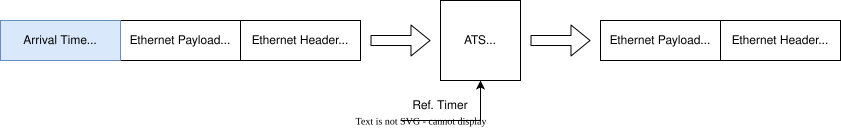

# Design considerations of ATS Switch

This document describes why the design of 10GbE ATS Switch is made.

## Changing bus width and clock speed

In developing the 10GbE version, we increased the bus width by 8 times from the 1GbE version and raised the clock frequency to 156.25 MHz, which is 10/8 times the previous frequency.  
As a result, the throughput is exactly 10 Gbps.

## Interface of timestamp values



The frame structure remains unchanged from 1GbE, with a 9-byte timestamp appended at the end.  
However, due to the bus width increasing to 8 bytes, the frame length will increase by either 1 or 2 cycles depending on the frame size.

## Design of module performance

We describe the design of module performance for our 10GbE ATS switch.

Most of our modules process 1 input frame.   
Typically, these modules parse the frame header, process the header, and send the payload to the next modules.  
As the header parsing requires some additional cycles, this overhead should not affect the switch performance.

```
  Frame input
<=================>
<===><=================>
header   Frame output
parse
```

The logics in FPGA are designed to be run at 156.25 MHz with 64 bits / cycle, and the throughput of these logics is exactly 10 Gbps.  
On the other hand, the throughput of the MAC TX/RX does not reach 10 Gbps.  
The theoretical limit can be calculated from the Ethernet specification.

```
   Frame               preamble + IPG + FCS     Frame              preamble + IPG + FCS
<====================><-------------------><====================><--------------------->
   N cycles              3 cycles             N cycles             3 cycles
```

The figure above shows the frame interval of inout frames.  
A preamble + IPG + FCS, as defined by the Ethernet specification, is appended between the input and output frames, resulting in a 3 cycle interval between each frame.  
The FCS is originally included in the L2 frame, but as it is processed within the Xilinx IP, it is not included in the frame.  
Therefore, each module can achieve the target performance by keeping the overhead per frame within 3 cycles.

However, as we described in [Interface of timestamp values](#interface-of-timestamp-values), our design appends 9 bytes timestamps at the tail of the frame.  
This reduces the acceptable overhead by 1 cycle or 2 cycles, resulting in 1 cycle.

Although most of our modules satisfy this constraint, a few modules do not.  
We improve the performance of these modules by either doubling the internal data width, duplicating and interleaving the logic, or splitting the matching process.
