# Design of ats-switch

This document describes design of the 4-port L2 switch with ATS implemented on FPGA.

## Overview

- Solid lines indicate data flow
  - Inside FPGA, data bus is AXI4-Stream 8 bit
<<<<<<< HEAD
-Dashed lines indicate clock domain boundaries
=======
- Dashed lines indicate clock domain boundaries
>>>>>>> dbb0d5b (AIST-TSN Switch V2.0 First commit)
  - Inside FPGA, clock frequency is 125 MHz

### MAC block

- The block that bridge data between PHY and inside FPGA
  - PHY: RGMII
  - Inside FPGA : AXI4-Stream
    - The tlast signal becomes Hi in the final beat of AXI4-Stream
- Remove Preamble, SFD and PCS from input Ethernet frame
- Conversely, add Preamble, SFD and PCS to output Ethernet frame
- The inside consists of the following modules
  - TEMAC: AMD/Xilinx official IP for MAC layer of Ethernet
  - eth_driver: The contoller for the MAC IP.
<<<<<<< HEAD
=======
  - FIFO + Frame Dropper: AMD/Xilinx AXI4-Stream Data FIFO IP and our own Frame Dropper IP. This is used to drop the entire frame if the FIFO has no space to store the frame.
>>>>>>> dbb0d5b (AIST-TSN Switch V2.0 First commit)

### FIFO block

- The FIFO for clock conversion between MAC side and FPGA core side
<<<<<<< HEAD
- They are set to Packet Mode
  - The Packet Mode configuration delays the start of packet (burst) transmission until the end (LAST beat) of the packet is received
- So, latency increases depending on the length of the stream (it is same as frame length)
- Note: It seems that Packet Mode is not required, so change the settings if you want to reduce latency
=======
>>>>>>> dbb0d5b (AIST-TSN Switch V2.0 First commit)

### Ref. Timer block

- This block generates reference timer count for each module
- The timer is managed as unsigned integer 72 bit
  - The value is zero when the power is turned on, and is incremented by 8,000 every 1 cycle
    - i.e. 1 count per 1 ps @ 125 MHz
  - So, overflow will occur 149 years ago after the power is turned on

<<<<<<< HEAD
### Scheduler block

- This block divides the input by priority and arbitrates all traffic classes after performing Set A.T. and Calc E.T. processing only for traffic class 7 and traffic class 6
  - Arbitrate algorithm is fixed priority, and Ethernet frames with higher priority are output first

### Set A.T. block
=======
### ATS Preprocess block

- This block has different functionality between KC705 and ZedBoard

#### ATS Preprocess block (KC705)

- This block divides the input by priority and arbitrates all traffic classes after performing Set A.T. processing only for traffic class 7 and traffic class 6
  - Arbitrate algorithm is fixed priority, and Ethernet frames with higher priority are output first

#### ATS Preprocess block (ZedBoard)

- This block divides the input by priority and arbitrates all traffic classes after performing Set A.T. and Calc E.T. processing only for traffic class 7 and traffic class 6
  - Arbitrate algorithm is fixed priority, and Ethernet frames with higher priority are output first
- For ZedBoard, TC0-TC4 are disabled. They are treated as TC5.

#### Set A.T. block
>>>>>>> dbb0d5b (AIST-TSN Switch V2.0 First commit)

- This block sets Arrival Time field to input Ethernet frame, but processing is skipped for frames below Traffic Class 5
  - A.T. stands for 'Arrival Time'
  - Arrival Time is attached to the end of the Ethernet frame
- The set value is the value of Ref. Timer block when the last beat of Ethernet frame passed
  - i.e. when the tlast of AXI4-Stream input is asserted

<<<<<<< HEAD
### Calc. E.T. block
=======
#### Calc. E.T. block
>>>>>>> dbb0d5b (AIST-TSN Switch V2.0 First commit)

- This block calculate Eligibility Time from Arrival Time, but processing is skipped for frames below Traffic Class 5
  - E.T. stands for 'Eligibility Time'
- The calculation is based on IEEE Std 802.1Q-2022 8.6.11.3 ProcessFrame(frame)
  - The calculation parameters can set independently per priority and flow
    - The flow is detected from IPv4 Src and Dst address and port of Input Ethernet frame
  - However, MaxResidenceTime is shared between flows
- If 'Eligibility Time - Arrival Time' is longer than MaxResidenceTime, the relevant Ethernet frame is discarded in this block.
  - i.e. not output to subsequent blocks
<<<<<<< HEAD
=======
- For KC705, this function is moved to ATS block.
>>>>>>> dbb0d5b (AIST-TSN Switch V2.0 First commit)

### Switch with FDB block

- This block is L2 Switch with FDB function
  - FDB stands for 'Filtering DataBase'
  - The FDB's job is to remember the MAC address information of each port and output Ethernet frames only to specific ports based on that information.
- The input/output specification of the switch is as follows
  - Input: 4 ports
    - Physical 4 ports
  - Output: 12 ports
    - Physical 4 ports
    - 3 non-self input ports
- See [switch_with_fdb_block.md](./blocks/switch_with_fdb_block.md) for details

### ATS block

<<<<<<< HEAD

- The block that controls output of Ethernet frame based on the comparison result of Eligibility Time and Ref. Timer
=======

- Input frame is a frame with Arrival Time in KC705.
- Eligibility Time calculation is done in ATS block.

- Input frame is a frame with with Eligibility Time in ZedBoard.

---

- For both design, ATS block controls output of Ethernet frame based on the comparison result of Eligibility Time and Ref. Timer
>>>>>>> dbb0d5b (AIST-TSN Switch V2.0 First commit)
  - When 'Eligibility Time < Ref.Timer', store Ethernet frame in FIFO until 'Eligibility Time >= Ref.Timer'
  - When 'Eligibility Time >= Ref.Timer', output Ethernet frame directly
- The above output control mechanism and FIFO exist independently for each input port and priority
- Eligibility Time field is removed from the output frame
- For frames of traffic class 5 and below, the FIFO scheduler is applied instead of the ATS scheduler, and frames of each traffic class are output in the order in which they are input
- See [ats_block.md](./blocks/ats_block.md) for details

### Clock Conv. block

- This block works as a simple clock converter.
- Unlike FIFO, it does not hold data internally, so latency is very low.

<<<<<<< HEAD
=======
## Feature Matrix

| group         | feature                                 | KC705                     | ZedBoard                 |
|---------------|-----------------------------------------|---------------------------|--------------------------|
| Common spec   |                                         |                           |                          |
|               | Link modes                              | 1000Base-T                | 1000Base-T               |
|               | Clock frequency                         | 125 MHz                   | 125 MHz                  |
|               | Max MTU                                 | 1500                      | 1500                     |
|               | Supported TCs                           | **TC0-TC7**               | **TC5-TC7** (\*1)        |
|               | TC Scheduling (TC6, TC7)                | ATS                       | ATS                      |
|               | TC Scheduling (Others)                  | Strict Priority           | Strict Priority          |
| Internal FIFO |                                         |                           |                          |
|               | MAC block (\*2)                         | 4096 bytes (default)      | 4096 bytes (default)     |
|               | FIFO block (\*2)                        | 4096 bytes (default)      | 4096 bytes (default)     |
|               | ATS Preprocess block (\*2)              | **0 bytes (default)**     | **2048 bytes (packet)**  |
|               | Switch with FDB block (\*2)             | **3072 bytes (default)**  | **2048 bytes (default)** |
|               | ATS block TC7 (\*2)                     | **6144 bytes (packet)**   | **4096 bytes (packet)**  |
|               | ATS block TC6 (\*2)                     | **6144 bytes (packet)**   | **4096 bytes (packet)**  |
|               | ATS block TC5 (\*2)                     | 8192 bytes (default)      | 8192 bytes (default)     |
|               | ATS block TC4 (\*2)                     | **8192 bytes (default)**  | **0 bytes (default)**    |
|               | ATS block TC3 (\*2)                     | **8192 bytes (default)**  | **0 bytes (default)**    |
|               | ATS block TC2 (\*2)                     | **16384 bytes (default)** | **0 bytes (default)**    |
|               | ATS block TC1 (\*2)                     | **16384 bytes (default)** | **0 bytes (default)**    |
|               | ATS block TC0 (\*2)                     | **16384 bytes (default)** | **0 bytes (default)**    |
| ATS logic     |                                         |                           |                          |
|               | Sorter between input ports              | **ET order**              | **Round-Robin**          |
|               | Accuracy of Eligibility Timestamp (\*3) | **More accurate**         | **Less accurate**        |
| FDB           |                                         |                           |                          |
|               | num of entries                          | **256**                   | **64**                   |

- \*1: TC0-TC4 is treated as TC5 in switch.
- \*2: The FIFO mode is described in parentheses: "default" means no delay. "packet" means that an entire frame is first stored into FIFO and then forwarded.
- \*3: ZedBoard may compute wrong Eligibility Time in some situations. For details, please see [Eligibility Timestamp calculation](./design_consideration.md#eligibility-timestamp-calculation)
>>>>>>> dbb0d5b (AIST-TSN Switch V2.0 First commit)
