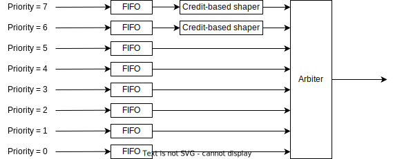

# CBS block

- This block has 8 inputs, which is priority 0 to 7
- All inputs has FIFO for storing Ethernet frame
- Credit-based shaper block provides bandwidth limitation based on Credit-based shaper algorithm
  - This block exists only in Priority 6 and 7
- Output port is just one, and Arbiter block selects Ethernet frame to output
  - Ethernet frame with higher Priority is output first

## FIFO block

- This block is a simple FIFO
  - FIFO depth is 16,384 Byte

## Credit-based shaper block

- This block provides bandwidth limitation based on Credit-based shaper algorithm
  - CBS behavior conform to IEEE Std 802.1Q-2022 8.6.8.2 Credit-based shaper algorithm

## Arbiter block

- This block arbitrates input Ethernet frames
  - Arbitrate algorithm is fixed-priority, Ethernet frame with higher Priority is output first
