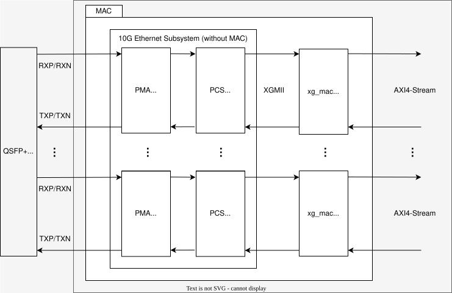

# Design of 10GbE cbs-switch

This document describes design of the 10GbE, 4-port L2 switch with CBS implemented on FPGA.

## Overview

- Solid lines indicate data flow
  - Inside FPGA, data bus is AXI4-Stream 64 bit
- Dashed lines indicate clock domain boundaries
  - Inside FPGA, clock frequency is 156.25 MHz

### MAC block

- The block that bridge data between PHY and inside FPGA
  - PHY: XGMII
  - Inside FPGA : AXI4-Stream
    - The tlast signal becomes Hi in the final beat of AXI4-Stream
- Remove Preamble, SFD and PCS from input Ethernet frame
- Conversely, add Preamble, SFD and PCS to output Ethernet frame
- The inside consists of the following modules
  - xgmac: Open-source IP for MAC layer of 10 GbE by Fixstars.
  - 10G Ethernet Subsystem: AMD/Xilinx official IP for MAC layer of Ethernet. As MAC functions are not free, only the free PMA/PCS functions are used.
  - FIFO + Frame Dropper: AMD/Xilinx AXI4-Stream Data FIFO IP and our own Frame Dropper IP. This is used to drop the entire frame if the FIFO has no space to store the frame. And it is also used for clock conversion between MAC side and FPGA core side.
    - FIFO depth is 4096

### Switch with FDB block

- This block is L2 Switch with FDB function
  - FDB stands for 'Filtering Database'
  - The FDB's job is to remember the MAC address information of each port and output Ethernet frames only to specific ports based on that information.
- The input/output specification of the switch is as follows
  - Input: 4 ports
    - Physical 4 ports
  - Output: 32 ports
    - Physical 4 ports
    - 8 priorities for each physical port
      - The priority is based on [Table of PCP vs priority](./specification.md#Table-of-PCP-vs-priority)
- See [switch_with_fdb_block.md](./blocks/switch_with_fdb_block.md) for details

### CBS block

- This block provides CBS function for priority 7 and 6
  - CBS stands for 'Credit Based Shaper'
  - CBS behavior conform to IEEE Std 802.1Q-2022 8.6.8.2 Credit-based shaper algorithm
- In addition, this block gives priority to frames with high priority and outputs them
  - However, switching is not performed during frame output
  - After a frame has been output, the frame with the highest priority is output next.
- See [cbs_block.md](./blocks/cbs_block.md) for details

### Clock Conv. block

- This block works as a simple clock converter.
- Unlike FIFO, it does not hold data internally, so latency is very low.

## Feature Matrix

| group         | feature                     | U45N                       | KC705                      | ZedBoard                   |
|---------------|-----------------------------|----------------------------|----------------------------|----------------------------|
| Basic spec.   |                             |                            |                            |                            |
|               | Link modes                  | **10000Base-R**            | **1000Base-T**             | **1000Base-T**             |
|               | Clock frequency             | **156.25 MHz**             | **125 MHz**                | **125 MHz**                |
|               | Bus width                   | **64 bits**                | **8 bits**                 | **8 bits**                 |
|               | Max MTU                     | 1500                       | 1500                       | 1500                       |
|               | Supported TCs               | TC0-TC7                    | TC0-TC7                    | TC0-TC7                    |
|               | TC Scheduling (TC6, TC7)    | CBS                        | CBS                        | CBS                        |
|               | TC Scheduling (Others)      | Strict Priority            | Strict Priority            | Strict Priority            |
| Internal FIFO |                             |                            |                            |                            |
|               | MAC block (\*1)             | 4096 bytes (default)       | 4096 bytes (default)       | 4096 bytes (default)       |
|               | FIFO block (\*1)            | **- (\*2)**                | **4096 bytes (packet)**    | **4096 bytes (packet)**    |
|               | Switch with FDB block (\*1) | 2048 bytes (default)       | 2048 bytes (default)       | 2048 bytes (default)       |
|               | CBS block (\*1)             | 16384 bytes / TC (default) | 16384 bytes / TC (default) | 16384 bytes / TC (default) |
| FDB           |                             |                            |                            |                            |
|               | num of entries              | **256**                    | **256**                    | **64**                     |
    
- \*1: The FIFO mode is described in parentheses: "default" means no delay. "packet" means that an entire frame is first stored into FIFO and then forwarded.
- \*2: This FIFO is not necessary for operation and has been omitted to reduce latency.
