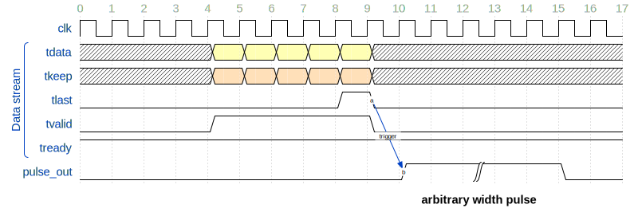

# Design of CBS Switch + probe outputs

This document describes design of the CBS switch with debug probes.  

## Overview

The CBS Switch + probe outputs design has the same functionality as CBS switch, and can also output data streaming signal from PMOD port.  
The data streaming signal can be used to detect frames with external devices such as an oscilloscope.

ZedBoard is the only board that can be used with this design. KC705 is not supported.

### Streaming detection

Since the switch uses AXI4-Stream protocol for frame transfer, the `tvalid, tready` handshake can be used for the data stream detection.
When `tvalid & tready` is true, data is streaming.  
By outputting this signal from the GPIO pin, it is possible to display the signal on an external oscilloscope. 
However, if the oscilloscope has a wide display range, it may miss frames with short frame lengths (such as TCP ACK).

For this reason, we have adopted a method that detects the end-of-frame signals (`tvalid & tready & tlast`) and expands them to an arbitrary pulse width.
With this method, you can choose a short pulse width if the oscilloscope display width is narrow, or a wide pulse width if it is not.

### Probe points

3 type of probe points are inserted to the design.

- Probe point #0: Input traffic per TCs.
    - TC1, TC5, TC6 and TC7 has probe point, per switch port.
    - total 16 probes (`= 4(TC) * 4(port)`)
- Probe point #1: Output traffic per TCs.
    - TC1, TC5, TC6 and TC7 has probe point, per switch port.
    - total 16 probes (`= 4(TC) * 4(port)`)
- Probe point #2: MAC input/output
    - RX port and TX port has probe point, per switch port
    - total 8 probes (`= 2(RX+TX) * 4(port)`)

Thus, the switch has a total of 40 point probes.


### Probe generation

In each probe points, the end-of-frame signals (`tlast & tvalid & tready`) is output as probe signal.  
Users can output any 4 of these 40 probes to external devices, and generate arbitrary length pulse signal by the probe signal with an IP named Pulse Generator.

The block diagram of Pulse Generator is as following:


This pulse generator can output up to 2 bit pulse signals from N bit input.  
In the CBS switch, pulse generator is configured to output up to 4 bit pulse signals from 40 bit input.

For each output port `i`, the pulse generator generates pulse signal with the following procedure.

```
out[i] = gen_pulse((in & mask[i]) != 0, pulse_width)
```

Users can set `mask[i]` and `pulse_width` signal via register interface.

The waveform of pulse generator is as following.



When the input signal is generated by end-of-frame signal, pulse generator generates arbitrary width pulse signal.

#### Pulse Generator Register interface

| name | address | description
|------|---------|-------------|
| mask0_lo | 0x40110000 | `mask[0][31:0]`
| mask0_hi | 0x40110004 | `mask[0][39:32]`
| mask1_lo | 0x40110008 | `mask[1][31:0]`
| mask1_hi | 0x4011000c | `mask[1][39:32]`
| mask2_lo | 0x40110010 | `mask[2][31:0]`
| mask2_hi | 0x40110014 | `mask[2][39:32]`
| mask3_lo | 0x40110018 | `mask[3][31:0]`
| mask3_hi | 0x4011001c | `mask[3][39:32]`
| pulse_width | 0x40110100 | 24 bit pulse width

The mask bit is corresponded to the following input probe points:

| mask bit | probe points |
|----------|--------------|
| [3:0]    | Probe point #0, port 0, [3]=TC7, [2]=TC6, [1]=TC5, [0]=TC1
| [7:4]    | Probe point #0, port 1, ...
| [11:8]    | Probe point #0, port 2, ...
| [15:12]    | Probe point #0, port 3, ...
| [19:16]    | Probe point #1, port 0, [19]=TC7, [18]=TC6, [17]=TC5, [16]=TC1
| [23:20]    | Probe point #1, port 1, ...
| [27:24]    | Probe point #1, port 2, ...
| [31:28]    | Probe point #1, port 3, ...
| [33:32]    | Probe point #2, port 0, [33]=TX, [32]=RX
| [35:34]    | Probe point #2, port 1, ...
| [37:36]    | Probe point #2, port 2, ...
| [39:38]    | Probe point #2, port 3, ...

##### Register setting examples

- Example 1: 
  - Input probe: MAC RX (Probe point #2), port 2
  - Output probe: output pin[2]
  - Register setting: set mask2 of bit[36]
    - mask2_lo = 0x0;
    - mask2_hi = 0x10;
- Example 2: 
  - Input probe: TC7 output (Probe point #1), port 1
  - Output probe: output pin 1
  - Register setting: set mask1 of bit[23]
    - mask1_lo = 0x0080_0000;
    - mask1_hi = 0;

You can set device registers with [our utility scripts](../../../util).  
Please look the [prerequisites](../../../util/cbs/README.md#prerequisites) before running the below commands.

The below command applys register setting in Example 1.

```sh
$ python3 set_pulse.py --board zedboard_with_probes probe 2 0x10_00000000
xsdb server launched.
List of available targets are as below:
1  xc7k325t
     2  Legacy Debug Hub
        3  JTAG2AXI
  4  xc7k325t
     5  Legacy Debug Hub
        6  JTAG2AXI
  7  APU
     8  ARM Cortex-A9 MPCore #0 (Running)
     9  ARM Cortex-A9 MPCore #1 (Running)
 10  xc7z020
    11  Legacy Debug Hub
       12  JTAG2AXI
Please type the number of target: 12
Output pin: 2
Mask: 0x1000000000
```

When running this command, you will be asked "Please type the number of target".  
Please select ZedBoard's (i.e. xc7z020 FPGA) JTAG2AXI target.  
In this example, 12 is the target number.

The below command applys register setting in Example 2.

```sh
$ python3 set_pulse.py --board zedboard_with_probes --jtag_target 12 probe 1 0x00_00800000
```

### Output pins layout

The pulse signals are sent to external via ZedBoard's PMOD port.  
The below figure shows which pins are used as probe pins.


If you want to detect signals with oscilloscopes, connect probe pin and near ground pin (if required.)

## How to use this design

### Build design

```sh
cd <project_root>
./build_device.sh cbs-switch-zedboard-with-probes
```

### Run design

Bitstream is generated to `build-device/vivado/cbs-switch-zedboard-with-probes.prj/cbs-switch-zedboard-with-probes.runs/impl_1/design_1_wrapper.bit`.  
After writing this bitstream, the switch can be used as the same way as the original CBS Switch.

## Visualize CBS function by oscilloscope

The rest of this document explains how to visualize the operation of the CBS switch using an oscilloscope while actually using the CBS switch.

In this document, we will check the following 2 behaviors.

1. The CBS traffic shaper splits up the frames that are input in bursts and outputs them.
2. The CBS traffic shaper can allocate bandwidth for lower priority frames.

### Setup environment

#### Physical connection

In the rest of this document, we assume that the system is connected as shown in the figure below.


First, prepare a host machine with at least two NIC ports and connect it to port 0 and port 2 of the OP031-2V5 card installed on the ZedBoard.  
Also connect the host PC and the USB JTAG port of the ZedBoard.

Next, remove the `probe[0], probe[2]` pins from the ZedBoard's Pmod and connect them to the oscilloscope.  
Connect the ground pins in the same way.  
The connections for each probe are as shown in [Output pins layout](#output-pins-layout).

Also set the DIP SW on the ZedBoard to 00000011 (0=down, 1=up) from the left.  

To see how the ZedBoard looks in our environment, please see below.


#### Network setting

Next, we set up the network.
In this example, we construct a network as shown in below.


We assume that the device name of NIC port0 is `enp5s0` and NIC port1 is `enp6s0`.  
If you want to check which port is connected to ZedBoard, please use `ip link` command and so on.

In the example above, the following network settings have been made.

- NIC port0
  - Set the IP address `192.168.0.4/24` to the normal device `enp5s0`.
  - Set the IP address `10.0.0.4/24` to the device `enp5s0.4` which is a sub device of `enp5s0`. Frames output from `enp5s0.4` is assigned VLAN4 and PCP3.
  -  Set the IP address `172.16.0.4/24` to the device `enp5s0.5` which is a sub device of `enp5s0`. Frames output from `enp5s0.5` is assigned VLAN5 and PCP2.
- NIC port1
  - The interfaces of NIC port1 is placed under the dedicated Linux network namespace named `ns1`.
  - Set the IP address `192.168.0.2/24` to the normal device `enp6s0`.
  - Set the IP address `10.0.0.2/24` to the device `enp6s0.4` which is a sub device of `enp6s0`. Frames output from `enp6s0.4` is assigned VLAN4 and PCP3.
  -  Set the IP address `172.16.0.2/24` to the device `enp6s0.5` which is a sub device of `enp6s0`. Frames output from `enp6s0.5` is assigned VLAN5 and PCP2.

VLAN (Virtual LAN) is a mechanism that allows networks to be virtually separated.   
In this example, three types of VLAN (no VLAN, VLAN 4, VLAN 5) are assigned and interfaces with the same VLAN can communicate with each other.   
For example, enp5s0 can communicate with enp6s0, but not with enp6s0.4.

When using VLAN, you can also set the PCP (Priority Code Point) as the priority of the frame. 
In our CBS switch, the priority of the frame is determined based on the PCP, so we set different values here.

Linux network namespace, which is used for NIC port1, is a network isolation mechanism of Linux.  
Linux network namespace is used in Docker containers, etc.   
In this example, it is used to avoid conflict of routing for IPs belonging to the same segment (e.g. enp5s0 192.168.0.4/24 and enp6s0 192.168.0.2/24).  
If these interfaces are isolated in different network namespaces, you can select which of interfaces is used for transmitting frames.  
For example, if you if you run the `ping 192.168.0.1` command, it will communicate from the enp5s0 device.  
However, if you run `sudo ip netns exec ns1 ping 192.168.0.1` command, it will communicate from the enp6s0 device within ns1. 

The script to set up the above network is shown below. 
After adapting it to your environment using `eth1, eth2`, you can build the network shown above by running this command.

<details> <summary> Click here </summary>

```sh
# install vlan package
sudo apt install vlan
```

```sh
# Please update these field for your environment
eth1=enp5s0
eth2=enp6s0

sudo vconfig add ${eth1} 4
sudo vconfig set_egress_map ${eth1}.4 0 3
sudo vconfig add ${eth1} 5
sudo vconfig set_egress_map ${eth1}.5 0 2

sudo vconfig add ${eth2} 4
sudo vconfig set_egress_map ${eth2}.4 0 3
sudo vconfig add ${eth2} 5
sudo vconfig set_egress_map ${eth2}.5 0 2

sudo ip addr add 192.168.0.4/24 dev ${eth1}
sudo ip addr add 10.0.0.4/24 dev ${eth1}.4
sudo ip addr add 172.16.0.4/24 dev ${eth1}.5
sudo ip link set dev ${eth1} up
sudo ip link set dev ${eth1}.4 up
sudo ip link set dev ${eth1}.5 up

sudo ip netns add ns1
sudo ip link set ${eth2} netns ns1
sudo ip link set ${eth2}.4 netns ns1
sudo ip link set ${eth2}.5 netns ns1
sudo ip netns exec ns1 ip addr add 192.168.0.2/24 dev ${eth2}
sudo ip netns exec ns1 ip addr add 10.0.0.2/24 dev ${eth2}.4
sudo ip netns exec ns1 ip addr add 172.16.0.2/24 dev ${eth2}.5
sudo ip netns exec ns1 ip link set dev ${eth2} up
sudo ip netns exec ns1 ip link set dev ${eth2}.4 up
sudo ip netns exec ns1 ip link set dev ${eth2}.5 up
```

</details>

#### Validate connection

We completed network configuration, so we check if frames can be sent as expected.  
Please configure ZedBoard with `design_1_wrapper.bit` created in [Run design](#run-design) step.

```sh
$ source /<your_vivado_install_dir>settings64.sh
$ xsdb
xsdb% connect
tcfchan#0
xsdb% target
  1  APU
     2  ARM Cortex-A9 MPCore #0 (Running)
     3  ARM Cortex-A9 MPCore #1 (Running)
  4  xc7z020
     5  Legacy Debug Hub
        6  JTAG2AXI
xsdb% target 4
xsdb% fpga design_1_wrapper.bit
100%    3MB   1.8MB/s  00:02
xsdb% exit
```

After bitstream is configured, ZedBoard works as L2 switch automatically.  
You can see that frame is sent from NIC port 1 in `ns1`, and received in NIC port 0, by `ping` command.

```sh
$ sudo ip netns exec ns1 ping -c 3 192.168.0.4
PING 192.168.0.4 (192.168.0.4) 56(84) bytes of data.
64 bytes from 192.168.0.4: icmp_seq=1 ttl=64 time=0.090 ms
64 bytes from 192.168.0.4: icmp_seq=2 ttl=64 time=0.124 ms
64 bytes from 192.168.0.4: icmp_seq=3 ttl=64 time=0.119 ms

--- 192.168.0.4 ping statistics ---
3 frames transmitted, 3 received, 0% frame loss, time 2040ms
rtt min/avg/max/mdev = 0.090/0.111/0.124/0.015 ms
```

Next, let's check that VLAN and PCP is tagged correctly.  
In this step, you needs 2 terminals.

First, start frame capture in the first terminal.  
`enp5s0` is a interface of NIC port0, and `-e icmp` means that only ICMP frame is captured.

```sh
sudo tcpdump -i enp5s0 -e icmp
```

Next, in the second terminal, send ping from 3 interfaces in `ns1`.  
Each command sends a ping frame from each interface.

```sh
sudo ip netns exec ns1 ping -c 1 192.168.0.4
sudo ip netns exec ns1 ping -c 1 10.0.0.4
sudo ip netns exec ns1 ping -c 1 172.16.0.4
```

When frame is captured successfully, you can see that 6 frames are captured as below.

```
17:40:45.444396 (snip), ethertype IPv4 (0x0800), length 98: 192.168.0.2 > 192.168.0.4: ICMP echo request, id 7735, seq 1, length 64
17:40:45.444422 (snip), ethertype IPv4 (0x0800), length 98: 192.168.0.4 > 192.168.0.2: ICMP echo reply, id 7735, seq 1, length 64
17:40:53.795026 (snip), ethertype 802.1Q (0x8100), length 102: vlan 4, p 3, ethertype IPv4 (0x0800), 10.0.0.2 > 10.0.0.4: ICMP echo request, id 8333, seq 1, length 64
17:40:53.795084 (snip), ethertype 802.1Q (0x8100), length 102: vlan 4, p 3, ethertype IPv4 (0x0800), 10.0.0.4 > 10.0.0.2: ICMP echo reply, id 8333, seq 1, length 64
17:40:56.865251 (snip), ethertype 802.1Q (0x8100), length 102: vlan 5, p 2, ethertype IPv4 (0x0800), 172.16.0.2 > 172.16.0.4: ICMP echo request, id 40851, seq 1, length 64
17:40:56.865316 (snip), ethertype 802.1Q (0x8100), length 102: vlan 5, p 2, ethertype IPv4 (0x0800), 172.16.0.4 > 172.16.0.2: ICMP echo reply, id 40851, seq 1, length 64
```

The first 2 frames are ping frames on the `192.168.0.0/24` network.  
Since this network is not assigned any VLAN tags, there are no VLAN tags in the captured frames.  

The next 2 frames are frames on the `10.0.0.0/24` network.
In this network, you can see that frames have `vlan 4, p 3` field (p 3 means PCP 3), as set in the procedure above.

The last 2 frames are frames on the `172.16.0.0/24` network.  
You can also see that frames have `vlan 5, p 2` field.

We have completed the environment settings.  
From here, we will activate the traffic shaping function of CBS switch, and check the results.

### 1. Traffic shaping of CBS

We will show that input frame rate is controlled by CBS's traffic shaper.

#### Activate CBS function

First, we will activate the traffic shaping function of CBS.  
2 procedures are required.

1. Map PCPs to the frame priority inside the switch.
2. Setting CBS's rate control per the priority.

Inside the switch, frames are assigned a priority based on the PCP field, and then distributed to the paths according to their priority, as shown in the below.  
In our CBS switch, the strict priority method is used, so the frames are output in order of priority, starting with the highest priority.

In addition, for priority 6 and 7, the output rate can be controlled by a function called Credit-based shaper (CBS).


From here on this document, this priority is referred to as Traffic Class (TC).

When mapping PCPs to TC, you can use a tcl script, [util/cbs/set_traffic_class.tcl](../../../util/cbs/set_traffic_class.tcl).  
This scripts requires 3 argument.

1. A TC for frames with no PCP value (i.e. no VLAN tags)
2. A TC for frames with PCP3
3. A TC for frames with PCP2

In this example, we set TC5 for no PCP frames, TC7 for PCP3 frames, and TC6 for PCP2 frames.  
Please run the following commands with `--jtag_target` option described in [Register setting examples](#register-setting-examples).

```sh
$ python3 set_traffic_class.tcl -1 5 --board zedboard --jtag_target 12
$ python3 set_traffic_class.tcl 3 7 --board zedboard --jtag_target 12
$ python3 set_traffic_class.tcl 2 6 --board zedboard --jtag_target 12
```

Next, we will set CBS's output rate.  
In CBS, there are 2 parameters to determine output rate, named `sendSlope` and `idleSlope`.  
`sendSlope` is a parameter that determines the degree to which credits are consumed during transmission. 
`idleSlope` is a parameter that determines the degree to which credits are produced during the idle period after transmission. 
In CBS, frames can be transmitted if the remaining credit balance is zero or positive.

In our CBS switch, the configuration is very simple.  
First, assign target output rate to `sendSlope` in Kbps.   
Finally, assign `sendSlope - 1Gbps` value to `idleSlope` in Kbps.  

The below command assigns 100 Mbps rate to TC7 frames, and 300 Mbps rate to TC6 frames.

```sh
$ python3 set_slope.py 7 100000 -900000 --board zedboard --jtag_target 12
$ python3 set_slope.py 6 300000 -700000 --board zedboard --jtag_target 12
```

Then, We validate the output rate of CBS switch.  
In this step, you need 2 terminals.

In the first terminal, run iperf3 server with the following command.  

```sh
sudo ip netns exec ns1 iperf3 -s
```

In the second terminal, run iperf3 client to sends frames from each interface.  
In the below command, `-u` option means that UDP is used, `-l 1472` option sets the frame payload to 1472 bytes, `-b 1000M` option sets the output rate to 1000 Mbps, and `-t 3` option sets the running time to 3 seconds.

<details> <summary> Results of iperf3 command  </summary>

```sh
$ iperf3 -c 192.168.0.2 -u -l 1472 -b 1000M -t 3
warning: UDP block size 1472 exceeds TCP MSS 1448, may result in fragmentation / drops
Connecting to host 192.168.0.2, port 5201
[  5] local 192.168.0.4 port 37058 connected to 192.168.0.2 port 5201
[ ID] Interval           Transfer     Bitrate         Total Datagrams
[  5]   0.00-1.00   sec   114 MBytes   956 Mbits/sec  81223
[  5]   1.00-2.00   sec   114 MBytes   956 Mbits/sec  81136
[  5]   2.00-3.00   sec   114 MBytes   957 Mbits/sec  81264
- - - - - - - - - - - - - - - - - - - - - - - - -
[ ID] Interval           Transfer     Bitrate         Jitter    Lost/Total Datagrams
[  5]   0.00-3.00   sec   342 MBytes   956 Mbits/sec  0.000 ms  0/243623 (0%)  sender
[  5]   0.00-3.04   sec   342 MBytes   943 Mbits/sec  0.015 ms  94/243582 (0.039%)  receiver

iperf Done.

$ iperf3 -c 172.16.0.2 -u -l 1472 -b 1000M -t 3
warning: UDP block size 1472 exceeds TCP MSS 1448, may result in fragmentation / drops
Connecting to host 172.16.0.2, port 5201
[  5] local 172.16.0.4 port 46158 connected to 172.16.0.2 port 5201
[ ID] Interval           Transfer     Bitrate         Total Datagrams
[  5]   0.00-1.00   sec   114 MBytes   952 Mbits/sec  80873
[  5]   1.00-2.00   sec   114 MBytes   955 Mbits/sec  81061
[  5]   2.00-3.00   sec   113 MBytes   949 Mbits/sec  80621
- - - - - - - - - - - - - - - - - - - - - - - - -
[ ID] Interval           Transfer     Bitrate         Jitter    Lost/Total Datagrams
[  5]   0.00-3.00   sec   341 MBytes   952 Mbits/sec  0.000 ms  0/242555 (0%)  sender
[  5]   0.00-3.25   sec   104 MBytes   267 Mbits/sec  0.073 ms  168747/242555 (70%)  receiver

iperf Done.

$ iperf3 -c 10.0.0.2 -u -l 1472 -b 1000M -t 3
warning: UDP block size 1472 exceeds TCP MSS 1448, may result in fragmentation / drops
Connecting to host 10.0.0.2, port 5201
[  5] local 10.0.0.4 port 39467 connected to 10.0.0.2 port 5201
[ ID] Interval           Transfer     Bitrate         Total Datagrams
[  5]   0.00-1.00   sec   113 MBytes   951 Mbits/sec  80727
[  5]   1.00-2.00   sec   114 MBytes   954 Mbits/sec  80966
[  5]   2.00-3.00   sec   113 MBytes   951 Mbits/sec  80776
- - - - - - - - - - - - - - - - - - - - - - - - -
[ ID] Interval           Transfer     Bitrate         Jitter    Lost/Total Datagrams
[  5]   0.00-3.00   sec   340 MBytes   952 Mbits/sec  0.000 ms  0/242469 (0%)  sender
[  5]   0.00-3.25   sec  34.6 MBytes  89.3 Mbits/sec  0.126 ms  217838/242468 (90%)  receiver

iperf Done.
```

</details>

The log shows achieved bandwidth for sender and receiver side, in the last 2 lines.   

```
[ ID] Interval           Transfer     Bitrate         Jitter    Lost/Total Datagrams
[  5]   0.00-3.00   sec   340 MBytes   952 Mbits/sec  0.000 ms  0/242469 (0%)  sender
[  5]   0.00-3.25   sec  34.6 MBytes  89.3 Mbits/sec  0.126 ms  217838/242468 (90%)  receiver
```

For TC5 frames (`192.168.0.0/24`), CBS does not affect these frames so output rate (943 Mbps) is almost the same as input rate (956 Mbps).  
For TC6 frames (`172.16.0.0/24`), due to the traffic shaping function of CBS, the output rate is limitted to 267 Mbps.  
For TC5 frames (`10.0.0.0/24`), the output rate is limitted to 89.3 Mbps.  

We show that CBS is correctly worked, however, the output rate is a little smaller than as target rate (300 Mbps or 100Mbps).  
This is because the CBS calculates rate by the whole frame (includes Ether header, IP header, UDP header and so on.), and iperf3 only computes the bandwidth only with the payload length.

#### Setup the oscilloscope

We visualize the actual frame flowing in the switch by oscillscope.  
Since the output probes are disabled as default, we enable the probes by the procedure describe in [Probe generation](#probe-generation).

First, please enable all conditions to capture any signals in oscilloscope.  

```sh
$ python3 set_pulse.py --board zedboard_with_probes --jtag_target 12 probe 0 0xff_ffffffff
$ python3 set_pulse.py --board zedboard_with_probes --jtag_target 12 probe 2 0xff_ffffffff
$ python3 set_pulse.py --board zedboard_with_probes --jtag_target 12 width 1500
```

When any frames are sent to the switch, HIGH signal is output from GPIO pin 0 and 2.
We set the register value to 1500, which is a typical length of a frame.

From here, you can visualize frames with `ping` commands.  
The below figure is an actual capture of our environment, when only output pin 0 is enabled.


#### Visualize CBS switch function

We will visualize the rate limit function of CBS Switch.  
Up to now, we have shown how CBS switch controls output rate, however, bandwidth control can also be done with CPU such as `-b` option in `iperf3`.  
If so, how is the CBS switch superior to the CPU?

Because the CBS switch is implemented on hardware, it can provide finer-grained bandwidth control than CPUs.  
While CPU-based control can guarantee a certain rate as an average per second, it cannot guarantee that the intervals are correct for each frame.  
However, the CBS switch uses hardware-based control, so it can actually guarantee this interval.

In this example, we set 2 probe points.

1. TC6 frames input from NIC port 0.
2. TC6 frames output to NIC port 1.

Please launch `xsdb` and apply the below commands.

```sh
# Output pin 0
# TC6 Input frame from port 0
$ python3 set_pulse.py --board zedboard_with_probes --jtag_target 12 probe 0 0x00_00000004

# Output pin 2
# TC6 Output frame to port 2
$ python3 set_pulse.py --board zedboard_with_probes --jtag_target 12 probe 2 0x00_04000000
```

In this evaluation, CBS is set to 500 Mbps.

```sh
$ python3 set_slope.py 7 500000 -500000 --board zedboard --jtag_target 12
$ python3 set_slope.py 6 500000 -500000 --board zedboard --jtag_target 12
```

Next, let's try throwing some actual traffic.
In this example, we will output frames at a rate of 500 Mbps for 1000 seconds.
The newly added `--pacing-timer` option is the interval at which iperf3 will perform rate control.
Here, we will set it to `1 [us]` to perform rate control at the minimum interval.

```sh
iperf3 -c 172.16.0.2 -u -l 1472 -b 500M -t 1000 --pacing-timer 1
```

The below figure shows the actual capture in oscilloscope.  
The yellow waveform shows the input frames, and they are bursting in units of 4 frames.  
On the other hand, the blue waveform shows the output frames, and you can see that the output frames are split cleanly due to the traffic shaping function of CBS switch.


You can see various behaviour by modifying the following parameters:

- `--pacing-timer`: If set to larger value, the longer burst length can be shown 
  - If set too much value, frame may be dropped due to the limit of internal switch buffer
- `set_slope` and `-b` option: If set to less value, wider frame interval can be shown.

### 2. best effort vs CBS traffic shaping

We will show that the CBS traffic shaper can allocate bandwidth to lower priority frames.

In this example, we generate the following 2 traffics:

1. TC1 traffic. This traffic is always generated.
2. TC5 or TC6 traffic. This traffic is generated for 1 second and then paused for 3 seconds, repeatedly.  

If the second traffic is TC5, which uses the best effort method, TC5 will always have a higher priority than TC1.  
TC5 temporarily occupies the network at 1Gbps and TC1 traffic cannot pass the switch.

On the other hand, if the second traffic is TC6, which uses CBS traffic shaping, TC6 will only be allocated a certain rate, and TC1 traffic will still be able to pass the switch at the remaining rate.

We will use the oscilloscope to visualize this behaviour.

#### Setup

In this example, we map no-PCP to TC5, PCP3 to TC1, and PCP2 to TC6.  

```sh
$ python3 set_traffic_class.tcl -1 5 --board zedboard --jtag_target 12
$ python3 set_traffic_class.tcl 3 1 --board zedboard --jtag_target 12
$ python3 set_traffic_class.tcl 2 6 --board zedboard --jtag_target 12
```

Next, we allocate 700 Mbps for TC6.

```sh
$ python3 set_slope.py 6 700000 -300000 --board zedboard --jtag_target 12
```

Finally, setup probes.

```sh
# Output pin 0
# TC5 or TC6 output frame to port 2 (0x6 = 2b0110)
$ python3 set_pulse.py --board zedboard_with_probes --jtag_target 12 probe 0 0x00_06000000

# Output pin 2
# TC1 Output frame to port 2
$ python3 set_pulse.py --board zedboard_with_probes --jtag_target 12 probe 2 0x00_01000000
```

#### Send traffic

In this example, we need 4 terminals.  

The first 2 terminals are used for iperf3 server.  
We assign different ports for each iperf3 command, with `-p` option.

```sh
# 1st terminal
sudo ip netns exec ns1 iperf3 -s
# 2nd terminal
sudo ip netns exec ns1 iperf3 -s -p 5202
```

Next, we send TC1 traffic from the third terminal by iperf3 command, to port 5202.  

```sh
# 3rd terminal
iperf3 -c 10.0.0.2 -u -l 1472 -b 1000M -t 1000 -p 5202
```

After running these commands, do not touch the 3 terminals until the end of this section.  

From the last terminal, generate TC5 traffic.  

```sh
# 4th terminal, TC5
iperf3 -c 192.168.0.2 -u -l 1472 -t 1000 -b 250M --pacing-timer 4000000
```

In this iperf3 command, we have allocated 250 Mbps bandwidth on average, and set pacing timer to 4000000 us (= 4 seconds).  
Each time the pacing timer expires, iperf3 flushes the buffered frames.  
In this example, buffering speed is 250Mbps, and pacing timer expires every 4 seconds.  
Therefore, iperf3 sends frames at 1Gbps for 1 second and then pauses for 3 seconds, repeatedly.

In this example, please set the sampling rate of oscilloscope to a very low value (e.g. 10 Hz).   

When TC5 traffic is generated, TC5 (yellow line) frames occupy the network and TC1 (blue line) frames do not pass at all.


Next, type Ctrl-C on the 4th terminal, and generate TC6 traffic.

```sh
# 4th terminal, TC6
iperf3 -c 172.16.0.2 -u -l 1472 -t 1000 -b 250M --pacing-timer 4000000
```

When TC6 traffic is generated, both TC6 and TC1 frames can pass.


