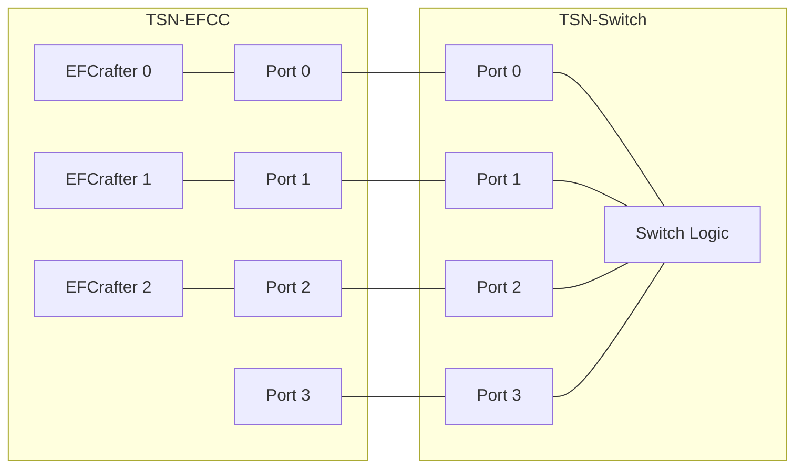

# Summary

This directory contains the results of the re-evaluation of CBS/ATS switches with TSN-EFCC (TODO: link here).  

The below figure illustrates the environment of the experiment.  
Up to 3 ef_crafters are used to transmit data to the switch, and Port 3 is reserved for receiving frame.  
The transmit timestamps and receive timestamps are recorded on each TSN-EFCC port, and used for latency or throughput measurement.



This directory contains 2 directories.

1. [cbs/](cbs/)
2. [ats/](ats/)

The [cbs/](cbs/) directory contains the data of the experiments to evaluate credit-based shaping (CBS) of our network switch. It is intended to be informative for those who are developing the network switch using our code and want to see if their switch correctly works.  
The performed experiments are the almost same as [../evaluation/cbs/](../evaluation/cbs/) directory.  
Although the purpose of experiments are the same, the test patterns are modified to suit the TSN-EFCC.

The [ats/](ats/) directory contains the data of the experiments to evaluate asynchronous traffic shaping (ATS) of our network switch. It is intended to be informative for those who are developing the network switch using our code and want to see if their switch correctly works.
The performed experiments are the almost same as [../evaluation/ats/](../evaluation/ats/) directory.  
Although the purpose of experiments are the same, the test patterns are modified to suit the TSN-EFCC.

For details, see [../evaluation/README.md](../evaluation/README.md).

## How to run the experiment

### Environment setup

#### Hardware Setup (1GbE)

In our experiment, the following hardware devices are required.

- 1 KC705 FPGA board (for TSN EFCC)
- 1 KC705 or ZedBoard FPGA board (for TSN Switch)
- 2 Opsero OP031 Ethernet FMC
- 1 Host machine

Then, connect them as following.

- Insert FMC to each boards and connect Ethernet port each other.
- Connect USB cable from the host machine to 2 FPGA boards.

#### Hardware Setup (10GbE)

In our experiment, the following hardware devices are required.

- 1 U45N or U250 FPGA board (for TSN EFCC)
- 1 U45N FPGA board (for TSN Switch)
- 1 QSFP28 cable or 1 QSFP+ cable
- 1 Host machine

Then, connect them as following.

- Connect the two FPGAs' QSFP28 slots with a cable.
   - For U45N, use the QSFP28 slot that is closer to the PCIe edge.
   - For U250, use the QSFP28 slot that is farther from the PCIe edge.
- Connect USB cable from the host machine to 2 FPGA boards.

#### Write bitstreams

If 2 boards are connected, xsdb shows target devices as below.

```
xsdb% targets
  1  xc7k325t
     2  Legacy Debug Hub
        3  JTAG2AXI
  4  APU
     5  ARM Cortex-A9 MPCore #0 (Running)
     6  ARM Cortex-A9 MPCore #1 (Running)
  7  xc7z020
     8  Legacy Debug Hub
        9  JTAG2AXI
```

The following is the step to write FPGA bitstreams.

1. Write TSN-EFCC's bitstream to target 1.
2. Write TSN-Switch's bitstream to target 7.

Then, the JTAG2AXI target is used to control FPGA registers.  
These target IDs are used in the [Run test](#run-test) step.

#### Python Environment

In our experiment, numpy and matplotlib packages are used.  
Although we used the following version of packages, the evaluation might be work in other versions.

```
pip3 install numpy==1.25 matplotlib==3.5.1
```

Add utility packages to PYTHONPATH.  
This packages contain utilities to control FPGA devices.

```
export PYTHONPATH=<project_root>/util/python
```

### Run test

Each directory contains 2 scripts.

- `eval.py`: a script to run evaluation.
- `plot.py`: a script to plot graphs.

The experiment is done by the following commands.

```
cd <experiment_dir>
python3 eval.py --efcc-jtag-target <efcc_jtag_target> --switch-jtag-target <switch_jtag_target> --board <kc705, zedboard or u45n>
python3 plot.py
```

`<efcc_jtag_target>, <switch_jtag_target>` are indices of JTAG2AXI target shown by xsdb.  
For the environment shown in [Write bitstreams](#write-bitstreams) step, set `<efcc_jtag_target>` to 3 and `<switch_jtag_target>` to 9.

## How to evaluate the result of experiment

After running `eval.py` and `plot.py`, the `results` directory is generated under `<experiment_dir>`.  
The directory contains the raw data of experiment and some graphs generated by the raw data.  
Although the meaning of the graphs is explained in the README of each directory, here we explain how the raw data is formatted.

The raw data is stored under `results/<configuration>/`.  
Typically, the directory contains the following files.

```
$ ls
diff_port0.csv  diff_port0_summary.txt  diff_port1.csv  diff_port1_summary.txt
port0_summary_bandwidth.txt  port1_summary_bandwidth.txt  recv.csv  send0.csv  send1.csv
```

- `send<N>.csv/recv.csv`: Dumps of timestamps for each send/recv port.
- `diff_port<N>.csv`: The difference of timestamps which is sent from port `N` and received by port 3.
- `diff_port<N>_summary.txt`: The latency summary of port `N`.
- `port<N>_summary_bandwidth.txt`: The bandwidth summary of port `N`.

### Format of `send<N>.csv/recv.csv`

These files are formatted as shown below.

```csv
timestamp_id,timestamp_val,timestamp_diff
0x40000000,2577732237,2577732237
0x40000002,2577735321,3084
0x40000004,2577738405,3084
0x40000006,2577741489,3084
0x40000008,2577744573,3084
0x4000000a,2577747657,3084
...
```

- The first line contains header information
  - timestamp_id: ID of the timestamp
  - timestamp_val: The timestamp value (unit: cycles, unsigned 32bit).
  - timestamp_diff: The difference of the timestamp value from the previous line
    - In the first line of data, the value of the this field is undefined.
- The other lines contain values.

### Format of `diff_port<N>.csv`

These files are formatted as shown below.

```csv
timestamp_id,timestamp_val,timestamp_diff
0x40000000,6424,6424
0x40000400,26772,20348
0x40000002,18360,-8412
0x40000600,27272,8912
...
```

- The file format is the same as `send<N>.csv/recv.csv`.
- The file contains the timestamps whose IDs are contained in both `send<N>.csv` and `recv.csv`.

### Format of `diff_port<N>_summary.txt`

These files are formatted as shown below.  

```
--------------------------------
TimestampStat(): id range = [0x40000000:0x40000bb6]
Minimum Timestamp: 51392.00 ns
Maximum Timestamp: 225280.00 ns
Average Timestamp: 217499.37 ns
Stddev Timestamp: 11173.96 ns
```

- The format shows the latency summary of frames which are sent from port `N` and received by port 3.

### Format of `port<N>_summary_bandwidth.txt`. 

These files are formatted as shown below.

```
--------------------------------
TimestampStat(): id range = [0x40000000:0x40000bb6]
# of sent frames: 1500
send rate: 488.653 Mbps
# of recvd frames: 306
recv rate: 99.685 Mbps
# of dropped frames: 1194
drop rate: 79.600 %
```

- The send rate shows the bandwidth of frames which are sent from port `N`.
- The recv rate shows the bandwidth of frames which are sent from port `N` and received by port 3.
- The drop rate shows the rate of frames which are dropped at recv port 3.
