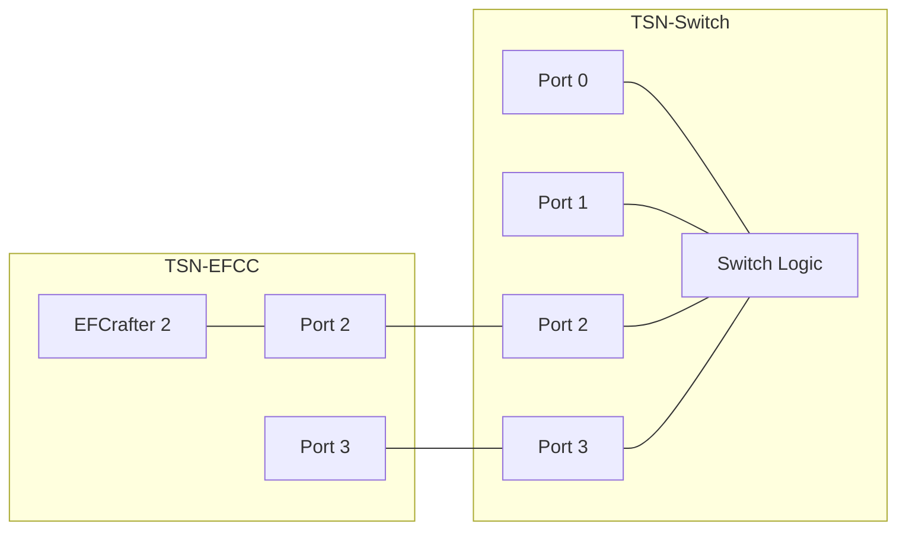
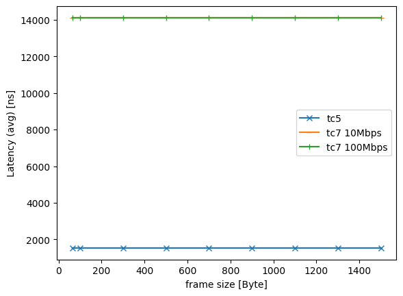
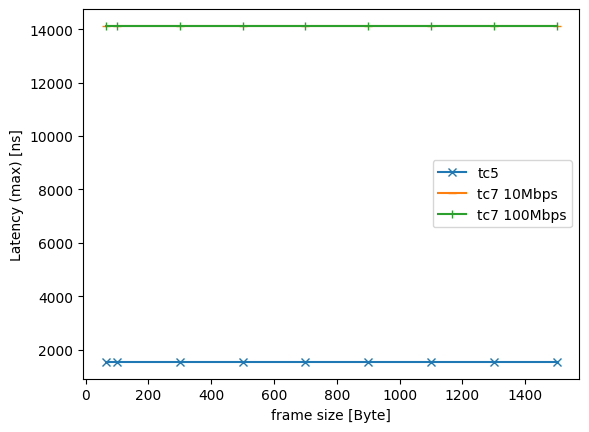
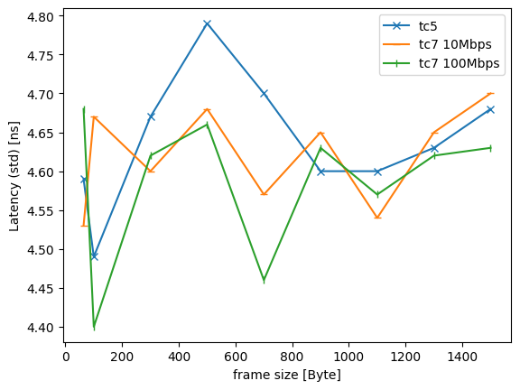
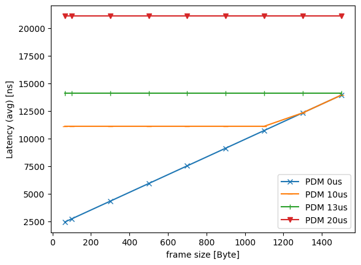
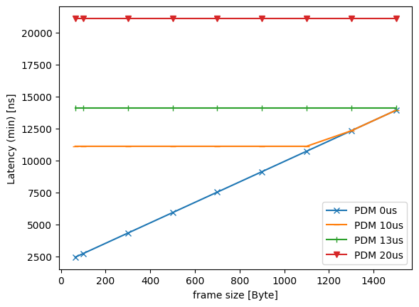
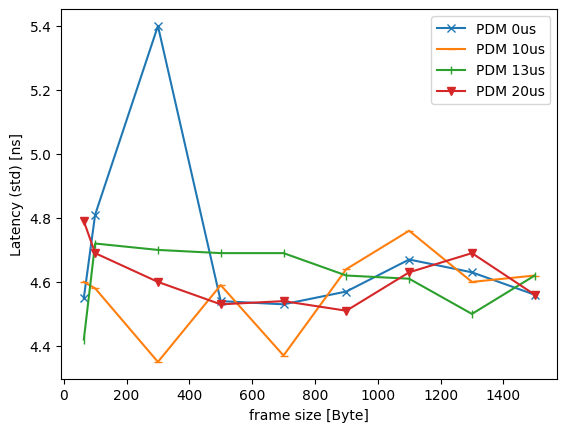

# ATS evaluation data 1

## Files

```
├── README.md       : This file
├── eval.py         : evaluation script
├── plot.py         : plot script
└── results         : result directory
```

## Network configuration



## ATS configuration

- TC7
  - CommittedInformationRate: 100 Mbps
  - CommittedBurstSize: 1542 Byte
  - ProcessingDelayMax: 26,000,000 ps
  - MaxResidenceTime: 134,217,728 ps
- TC6
  - CommittedInformationRate: 100 Mbps
  - CommittedBurstSize: 1542 Byte
  - ProcessingDelayMax: 26,000,000 ps
  - MaxResidenceTime: 134,217,728 ps

## Input pattern

- frame size: 64B, 100B, 300B, 500B, 700B, 900B, 110B, 1300B, 1500B
- the number of frames: 1000
- input traffic classes: TC5, TC7
- input rate: less than 5 Mbps

## Experiment result

These graphs show the average, minimum, maximum, and standard deviation of frame latency.






### Processing Delay Max (PDM) measurement

These graphs show the average, minimum, maximum, and standard deviation of frame latency of TC7, with different PDM values.





