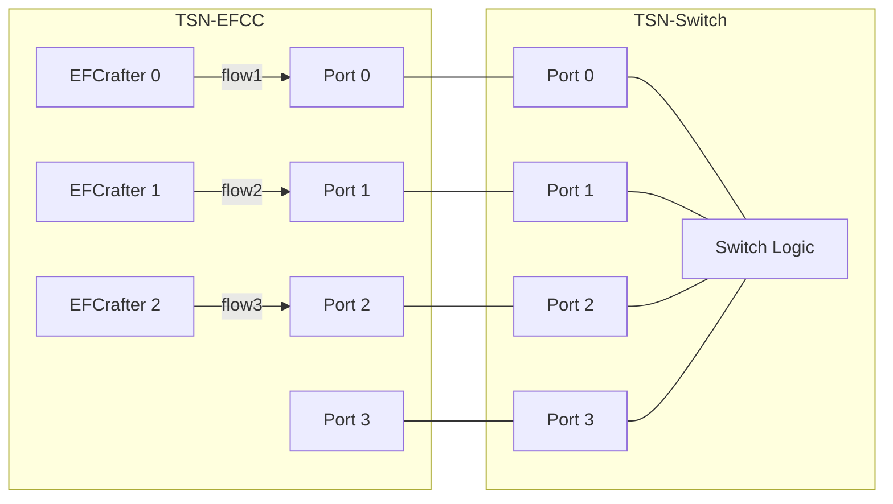
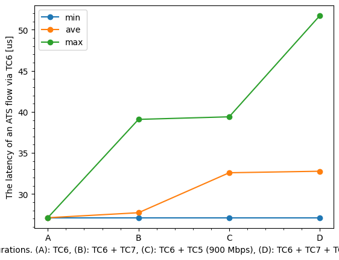
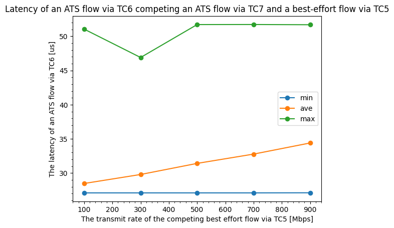

# ATS evaluation data 10

## Files

```
├── README.md       : This file
├── eval.py         : evaluation script
├── plot.py         : plot script
└── results         : result directory
```

## Network configuration



## Difference from the original experiment

In the original experiment of [../../../evaluation/ats/9](../../../evaluation/ats/9), the experiment uses one physical NIC for generate flow2 and flow3.

In this evaluation, we use 1 EFCrafter per flow2 and flow3.

## ATS configuration

- TC7
  - flow2
    - CommittedInformationRate: 100 Mbps
    - CommittedBurstSize: 1542 Byte
    - ProcessingDelayMax: 26,000,000 ps
    - MaxResidenceTime: 134,217,728 ps
- TC6  
  - flow1
    - CommittedInformationRate: 100 Mbps
    - CommittedBurstSize: 1542 Byte
    - ProcessingDelayMax: 26,000,000 ps
    - MaxResidenceTime: 134,217,728 ps

## Input pattern

- frame size: 1522 Bytes
- the number of frames: 1000
- input traffic classes: TC6 (flow1), TC7 (flow2), TC5 (flow3)
- input rate:
  - pattern (A):
    - flow1 (TC6): 97 Mbps
  - pattern (B):
    - flow1 (TC6): 97 Mbps
    - flow2 (TC7): 100 Mbps
  - pattern (C):
    - flow1 (TC6): 97 Mbps
    - flow3 (TC5): 100, 300, 500, 700, 900 Mbps
  - pattern (D):
    - flow1 (TC6): 97 Mbps
    - flow2 (TC7): 100 Mbps
    - flow3 (TC5): 100, 300, 500, 700, 900 Mbps

## Experiment result

This graph shows the latency of flow1 (TC6) frames competing with frames of other TCs.



This graph shows the latency of flow1 (TC6) frames competing with frames of flow2 (TC7) and flow3 (TC5), at different TC5 rates.


