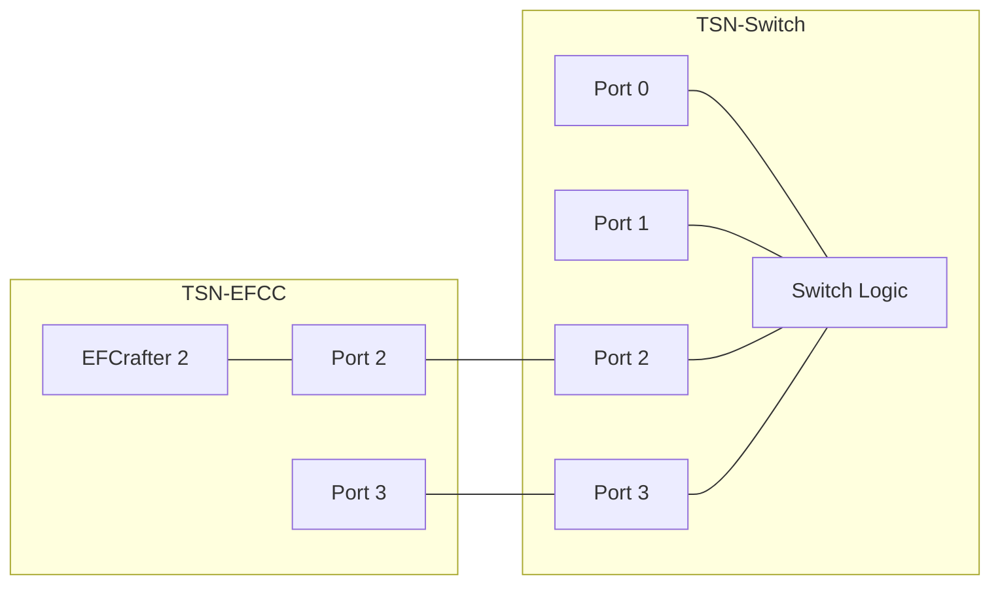
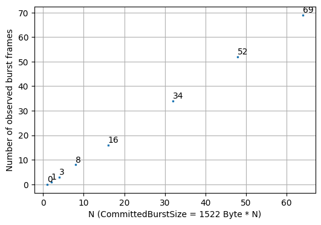
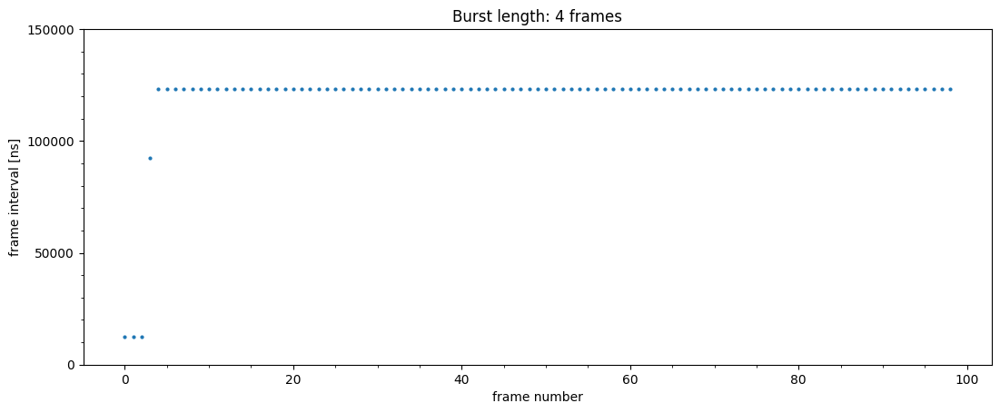
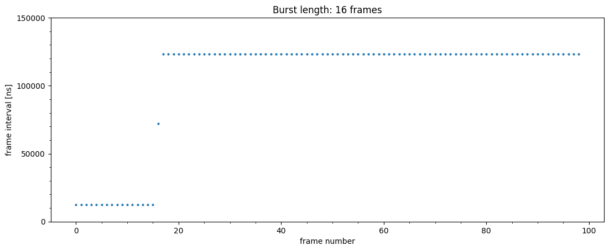
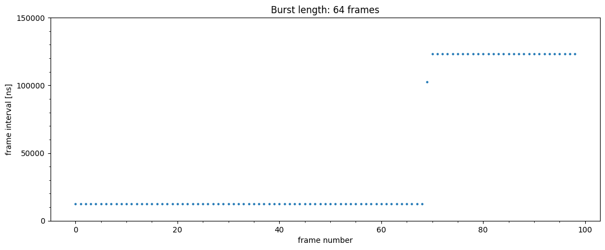

# ATS evaluation data 2

## Files

```
├── README.md       : This file
├── eval.py         : evaluation script
├── plot.py         : plot script
└── results         : result directory
```

## Network configuration



## ATS configuration

- TC7
  - CommittedInformationRate: 100 Mbps
  - CommittedBurstSize: 1542 * N Byte
  - ProcessingDelayMax: 26,000,000 ps
  - MaxResidenceTime: 134,217,728 ps

## Input pattern

- frame size: 1522 Bytes
- the number of frames: 100
- input traffic classes: TC7
- input rate: 1000 Mbps
- committed burst size: 1542 * N bytes
  - where N = 1, 2, 4, 8, 16, 32, 48, 64

## Experiment result

This graph shows the number of observed burst frames.



These graphs show the frame interval of each frame, with burst length of 4, 16 and 64.






