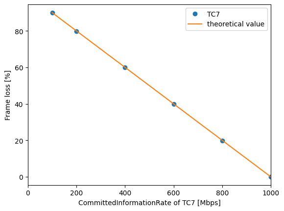

# ATS evaluation data 3

## Files

```
├── README.md       : This file
├── eval.py         : evaluation script
├── plot.py         : plot script
└── results         : result directory
```

## Network configuration


## ATS configuration

- TC7
  - CommittedInformationRate: 100, 200, 400, 600, 800, 1000 Mbps
  - CommittedBurstSize: 1542 Byte
  - ProcessingDelayMax: 26,000,000 ps
  - MaxResidenceTime: 134,217,728 ps

## Input pattern

- frame size: 1522 Bytes
- the number of frames: 100
- input traffic classes: TC7
- input rate: 1000 Mbps
- committed information rate: 100, 200, 400, 600, 800, 1000 Mbps

## Experiment result

This graph show the arrival rate of frame, and the theoretical value.


This graph show the frame loss rate of frame, and the theoretical value.



This graph show the minimum, average and maximum of frame latency, and the theoretical value.


