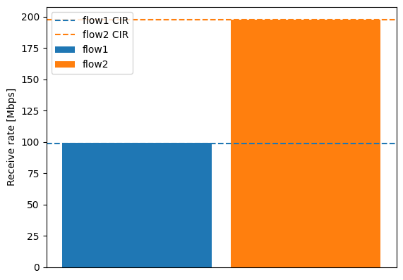

# ATS evaluation data 4

## Files

```
├── README.md       : This file
├── eval.py         : evaluation script
├── plot.py         : plot script
└── results         : result directory
```

## Network configuration

This experiment send 2 flows from a ef_crafter.


## ATS configuration

- TC7
  - flow1: 
    - CommittedInformationRate: 100 Mbps
    - CommittedBurstSize: 1542 Byte
    - ProcessingDelayMax: 26,000,000 ps
    - MaxResidenceTime: 134,217,728 ps
  - flow2: 
    - CommittedInformationRate: 200 Mbps
    - CommittedBurstSize: 1542 Byte
    - ProcessingDelayMax: 26,000,000 ps
    - MaxResidenceTime: 134,217,728 ps

## Input pattern

- frame size: 1522 Bytes
- the number of frames: 1000
- input traffic classes: TC7
- input rate:
  - flow1: 500 Mbps
  - flow2: 500 Mbps

## Experiment result

This graph shows the arrival rate of flow1 and flow2.



This graph shows the frame interval of arrived frame of flow1 and flow2.


