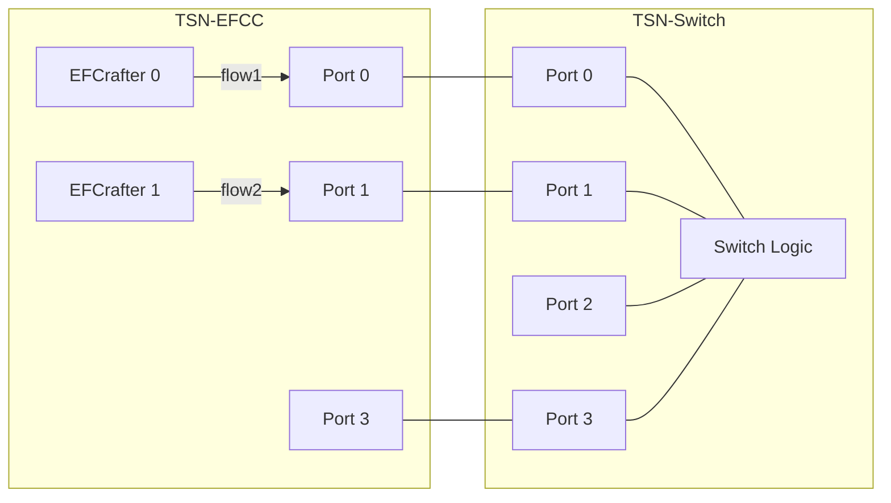
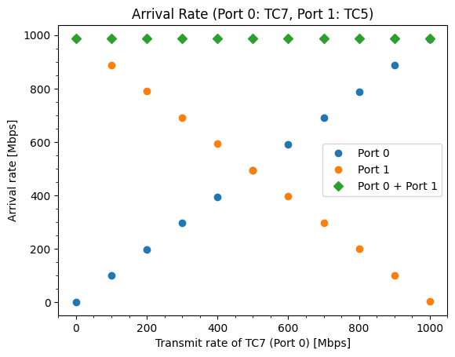
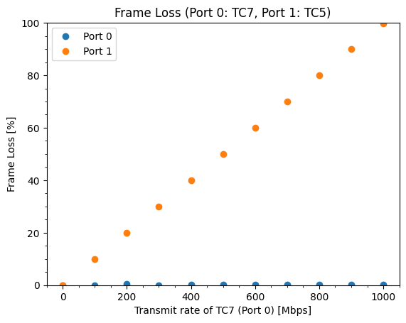

# ATS evaluation data 5

## Files

```
├── README.md       : This file
├── eval.py         : evaluation script
├── plot.py         : plot script
└── results         : result directory
```

## Network configuration



## ATS configuration

- TC7
  - CommittedInformationRate: 1000 Mbps
  - CommittedBurstSize: 1542 Byte
  - ProcessingDelayMax: 26,000,000 ps
  - MaxResidenceTime: 134,217,728 ps

## Input pattern

- frame size: 1522 Bytes
- the number of frames: 1000
- input traffic classes: TC7 (flow1) and TC5 (flow2)
- input rate:
  - flow1: 0, 100, 200, 300, 400, 500, 600, 700, 800, 900, 1000 Mbps
  - flow2: 1000 Mbps

## Experiment result

This graph shows the arrival rate and frame loss rate of flow1 (TC7) and flow2 (TC5) at different input rates of flow1.




