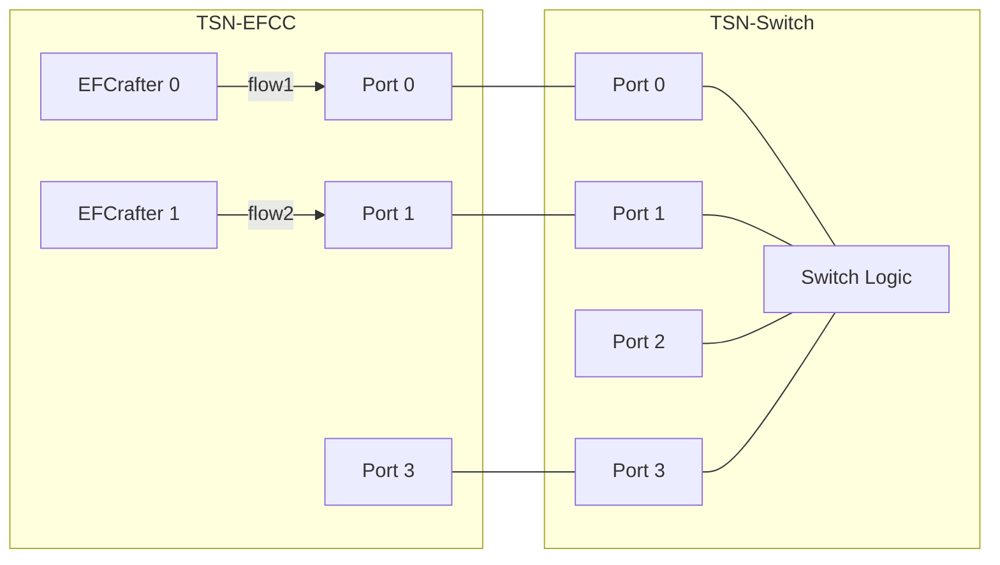
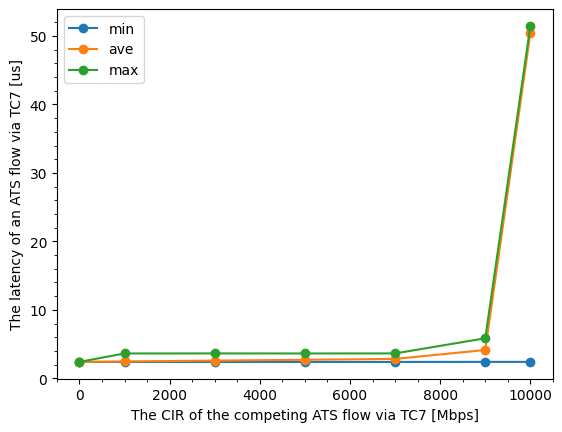
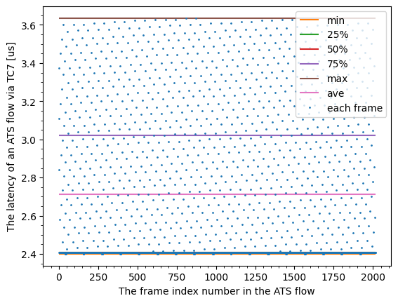

# ATS evaluation data 7

## Files

```
├── README.md       : This file
├── eval.py         : evaluation script
├── plot.py         : plot script
└── results         : result directory
```

## Network configuration



## ATS configuration

- TC7
  - flow1
    - CommittedInformationRate: 1000 Mbps
    - CommittedBurstSize: 1542 Byte
    - ProcessingDelayMax: 26,000,000 ps
    - MaxResidenceTime: 134,217,728 ps
  - flow2
    - CommittedInformationRate: 0, 1000, 3000, 5000, 7000, 9000, 10000 Mbps
    - CommittedBurstSize: 1542 Byte
    - ProcessingDelayMax: 26,000,000 ps
    - MaxResidenceTime: 134,217,728 ps

## Input pattern

- frame size: 1522 Bytes
- the number of frames: 1000
- input traffic classes: TC7 (flow1, flow2)
- input rate:
  - flow1: 970 Mbps
  - flow2: 10000 Mbps
    - limited by CIR of 0, 1000, 3000, 5000, 7000, 9000, 10000 Mbps

## Experiment result

This graph shows the latency of flow1 (TC7) frames competing with flow2 (TC7) frames.



This graph plots the latency of each flow1 (TC7) frame, competing with 5000 Mbps of flow2 (TC7) frames.


