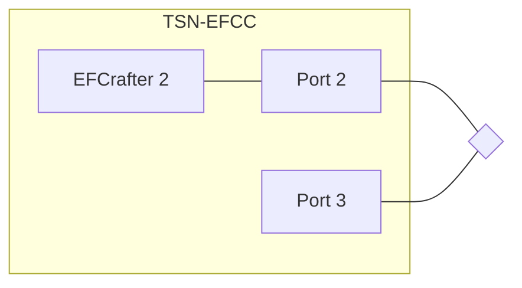
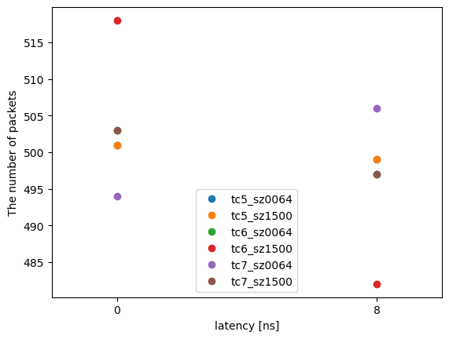

# CBS evaluation data 1

## Files

```
├── README.md       : This file
├── eval.py         : evaluation script
├── plot.py         : plot script
└── results         : result directory
```

## Network configuration



### Additional setup
Port 2 and Port 3 is connected directly.

## Input pattern

- frame size: 64B or 1500B
- the number of frames: 1000
- input traffic classes: TC5, TC6, TC7
- input rate: less than 5 Mbps

## Experiment result

The graph shows the number of frames with a latency of 0 ns or 8 ns.  
As TSN-EFCC has a function of latency adjustment internally, the only visible timestamp is 0 ns or 8 ns (1-cycle dispersion).


