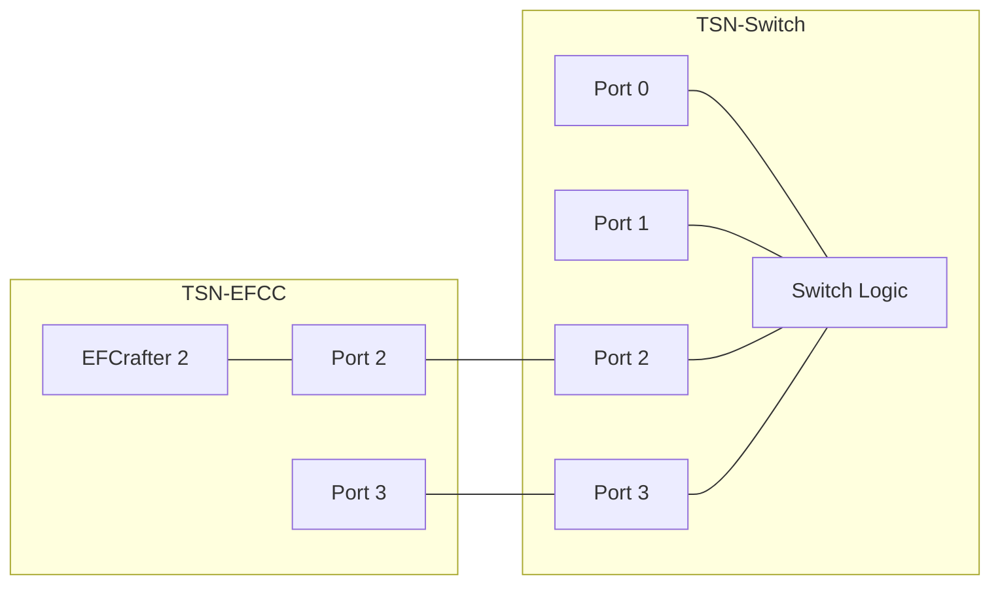
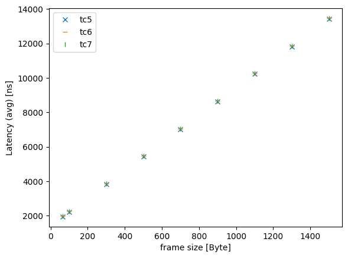
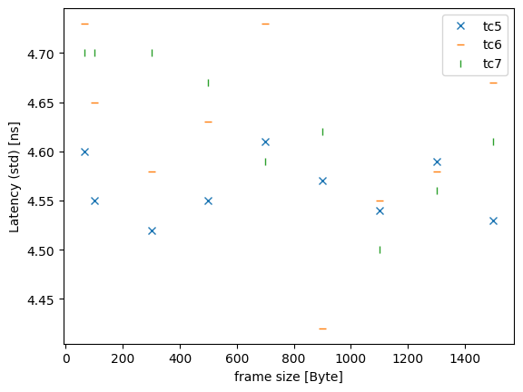

# CBS evaluation data 2

## Files

```
├── README.md       : This file
├── eval.py         : evaluation script
├── plot.py         : plot script
└── results         : result directory
```

## Network configuration



## CBS configuration

- TC7
  - idleSlope: 10 % (100 Mbps)
  - sendSlope: -90 %
- TC6
  - idleSlope: 1 % (10 Mbps)
  - sendSlope: -90 %

## Input pattern

- frame size: 64B, 100B, 300B, 500B, 700B, 900B, 110B, 1300B, 1500B
- the number of frames: 1000
- input traffic classes: TC5, TC6, TC7
- input rate: less than 5 Mbps

## Experiment result

These graphs show the average, minimum, maximum, and standard deviation of frame latency.






