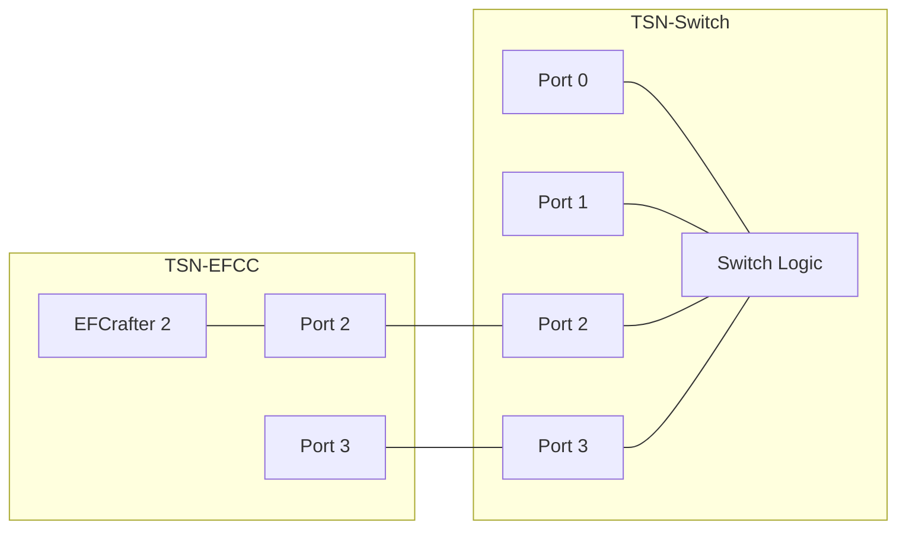
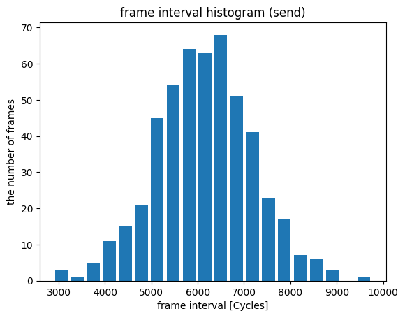
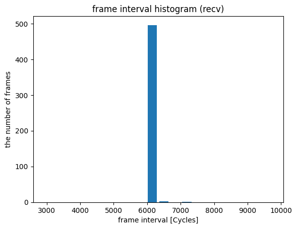
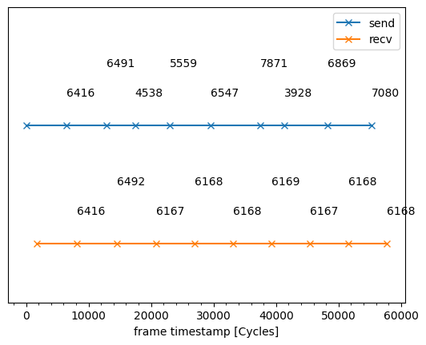

# CBS evaluation data 3

## Files

```
├── README.md       : This file
├── eval.py         : evaluation script
├── plot.py         : plot script
└── results         : result directory
```

## Network configuration



## Difference from the original experiment

In the original experiment of [../../../evaluation/cbs/3](../../../evaluation/cbs/3), the experiment is done in very low bandwidth (1 Mbps), to show the frame interval adjustment function of CBS.  

In this evaluation, we use higher average bandwidth (250 Mbps) input, and use a normal distribution to adjust frame interval.   
This experiment shows that CBS can adjust the random frame interval to fixed value.

## CBS configuration

- TC7
  - idleSlope: 25 % (250 Mbps)
  - sendSlope: -25 %

## Input pattern

- frame size: 1500 B
- the number of frames: 500
- input traffic classes: TC7
- input rate: 250 Mbps
  - The frame transmission interval follows a normal distribution with a standard deviation of 1000 cycles.

## Experiment result

These graphs show the histogram of send/recv frame interval.  




This graph shows the timestamps of 1st frames. The labels are the frame interval from the previous frame.


