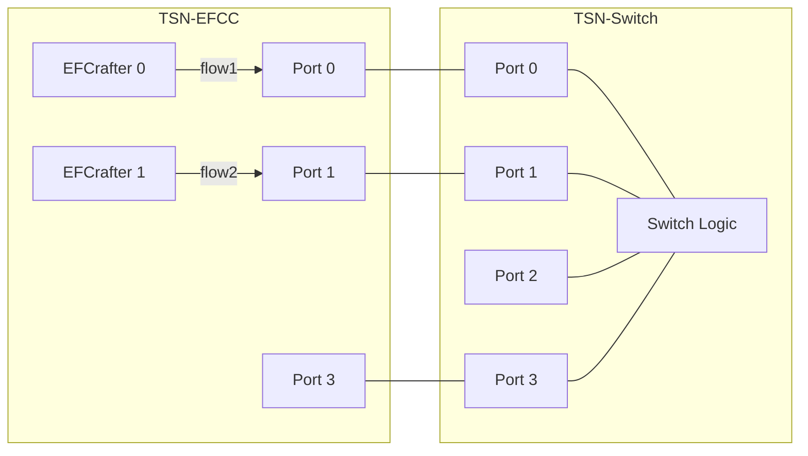
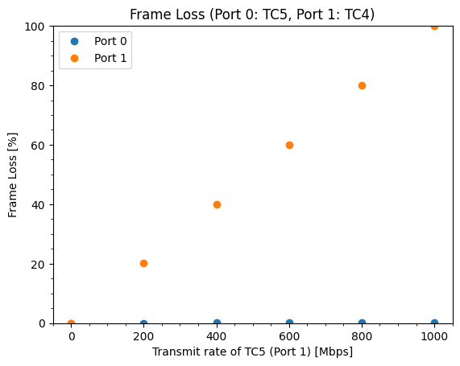
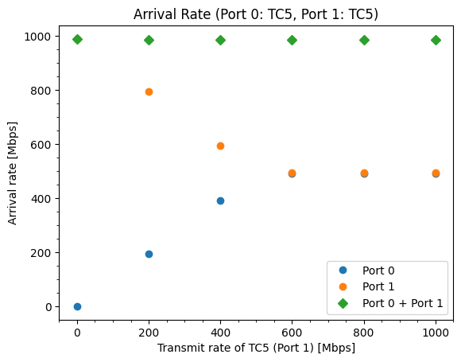
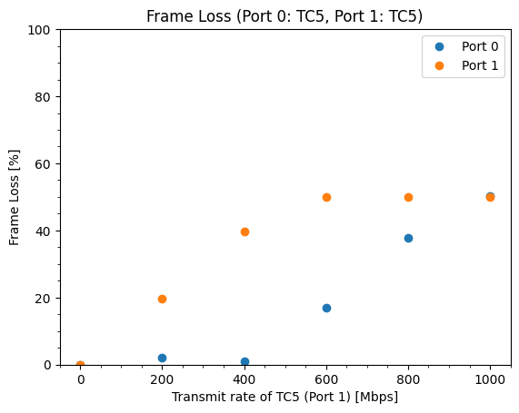
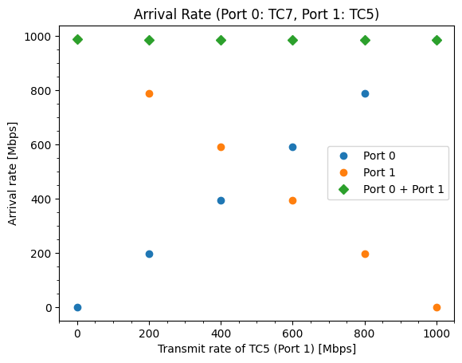
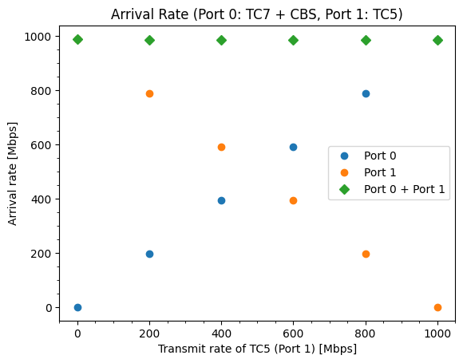
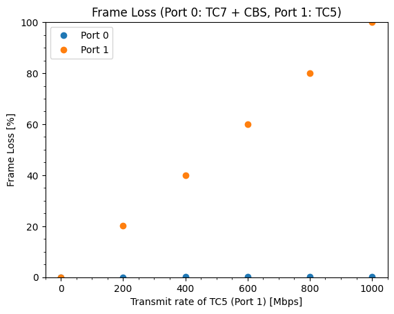

# CBS evaluation data 4

## Files

```
├── README.md       : This file
├── eval.py         : evaluation script
├── plot.py         : plot script
└── results         : result directory
```

## Network configuration



## CBS configuration

- TC7 (default)
  - idleSlope: 100 % (1000 Mbps)
  - sendSlope: -0 %

## Input pattern

- frame size: 1500 B
- the number of frames: 1000
- input traffic classes: 
  - pattern (A):
    - flow1: TC5
    - flow2: TC4
  - pattern (B):
    - flow1: TC5
    - flow2: TC5
  - pattern (C):
    - flow1: TC7
    - flow2: TC5
  - pattern (D):
    - flow1: TC7 (The slopes is configured to be the same value with input rate)
    - flow2: TC5
- input rate:
  - flow1: 0, 200, 400, 600, 800, 1000 Mbps
  - flow2: 1000 Mbps

## Experiment result

These graphs show the frame arrival rate of frames of each TC, and frame loss rate of each TC.

### pattern (A)




### pattern (B)




### pattern (C)




### pattern (D)




