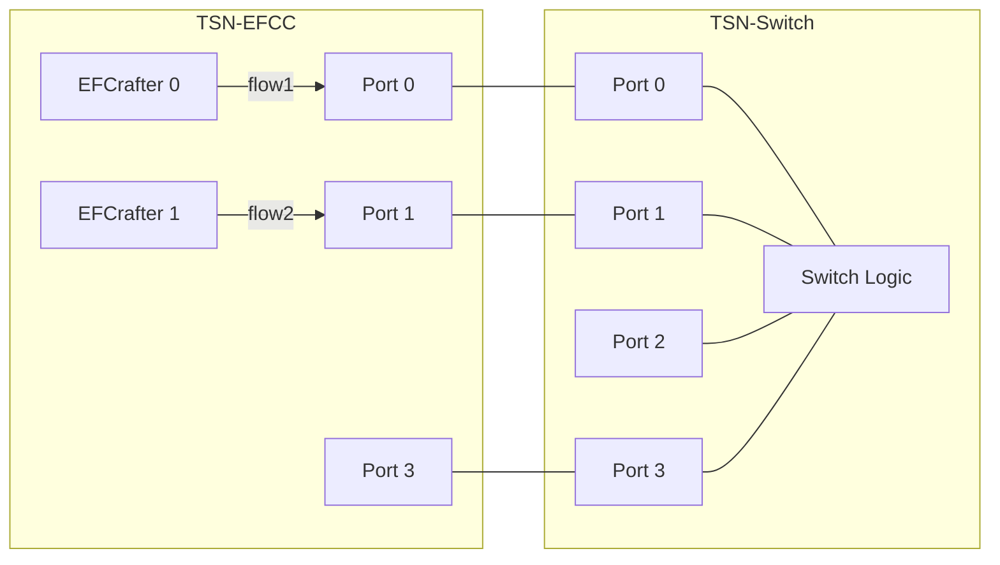
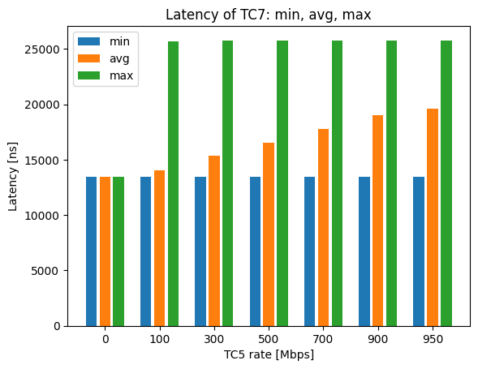
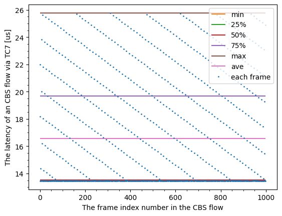

# CBS evaluation data 5

## Files

```
├── README.md       : This file
├── eval.py         : evaluation script
├── plot.py         : plot script
└── results         : result directory
```

## Network configuration



## CBS configuration

- TC7
  - idleSlope: 9.7 % (97 Mbps)
  - sendSlope: -90.3 %

## Input pattern

- frame size: 1500 B
- the number of frames: 1000
- input traffic classes: TC7 (flow1) and TC5 (flow2)
- input rate:
  - flow1 (TC7): 97 Mbps
  - flow2 (TC5): 0, 100, 300, 500, 700, 900, 950 Mbps

## Experiment result

This graph shows the minimum, average and maximum of TC7 frame latency competing with TC5 frames.



This graph plots the latency of TC7 frames competing with 500 Mbps of TC5 frames.


