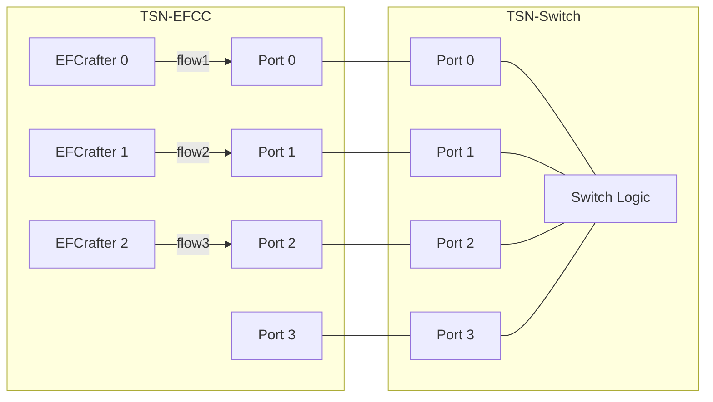
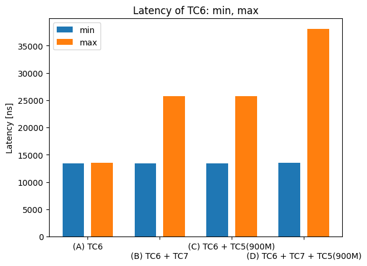
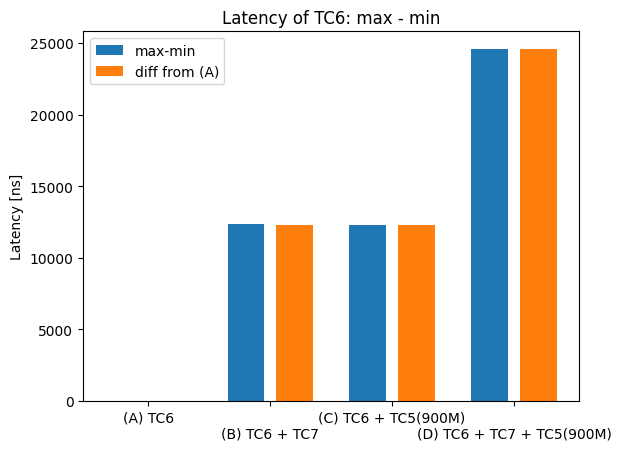

# CBS evaluation data 7

## Files

```
├── README.md       : This file
├── eval.py         : evaluation script
├── plot.py         : plot script
└── results         : result directory
```

## Network configuration



## CBS configuration

- TC7
  - idleSlope: 10 % (100 Mbps)
  - sendSlope: -90 %
- TC6
  - idleSlope: 10 % (100 Mbps)
  - sendSlope: -90 %

## Input pattern

- frame size: 1500 B
- the number of frames: 1000
- input traffic classes: TC6 (flow1), TC7 (flow2) and TC5 (flow3)
- input rate:
  - pattern (A):
    - flow2 (TC6): 97 Mbps
  - pattern (B):
    - flow2 (TC6): 97 Mbps
    - flow3 (TC7): 100 Mbps
  - pattern (C):
    - flow2 (TC6): 97 Mbps
    - flow1 (TC5): 100, 200, 300, 400, 500, 600, 700, 800, 900 Mbps
  - pattern (D):
    - flow2 (TC6): 97 Mbps
    - flow3 (TC7): 100 Mbps
    - flow1 (TC5): 100, 200, 300, 400, 500, 600, 700, 800, 900 Mbps

## Experiment result

This graph shows the minimum, average and maximum of TC6 frame latency competing with frames of the other TCs.



This graph shows the difference between the maximum latency of TC6 and the minimum latency of TC6, and the difference between the maximum latency of (B), (C), (D) and the maximum latency of (A).


